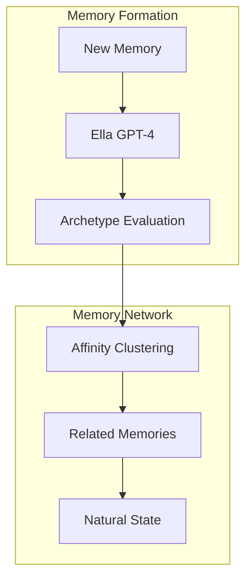

# EUMAS (Ella Unified Memory Augmentation System)

## Overview
EUMAS is an elegant memory system that uses GPT-4's natural understanding to create a dynamic, self-organizing network of memories. By combining GPT-4's contextual awareness with affinity-based clustering, EUMAS allows Ella to naturally develop and evolve her personality through her experiences and interactions.

## Core Concepts

### Natural Memory Formation
- **Self-Reflection**: Memories are evaluated through different aspects of Ella's personality
- **Affinity Clustering**: Related memories naturally group based on shared context and meaning
- **Dynamic State**: Personality emerges organically from conversation flow and memory activation

### Implementation
```python
# Creating and evaluating a memory
memory = Memory("I love how the sunset looks today!")
evaluation = await ella.evaluate_memory(memory)

# Finding related memories through affinity
related = await find_related_memories(memory)

# Natural state emerges from context
state = await ella.reflect_on_state(
    context=current_conversation,
    active_memories=related
)
```

## Components

### Memory System
- [Memory Management](./docs/components/memory.md): How memories are stored and retrieved
- [Context Engine](./docs/components/context.md): Natural flow of conversation and state
- [Archetype System](./docs/components/archetypes.md): Different aspects of Ella's personality
- [Query Engine](./docs/components/query.md): Finding and connecting relevant memories

### Infrastructure
- **Supabase**: PostgreSQL database with vector search capabilities
- **OpenAI GPT-4**: Core intelligence for memory evaluation and personality
- **Python Backend**: Simple, efficient memory operations
- **WebSocket API**: Real-time conversation updates

## Memory Graph



## Getting Started

1. **Setup Environment**
   ```bash
   pip install -r requirements.txt
   ```

2. **Configure API Keys**
   ```bash
   export OPENAI_API_KEY="your-key-here"
   export SUPABASE_URL="your-url-here"
   export SUPABASE_KEY="your-key-here"
   ```

3. **Run EUMAS**
   ```bash
   python -m eumas.main
   ```

## Documentation
- [Implementation Guide](./docs/IMPLEMENTATION.md): Detailed setup and usage
- [Memory Architecture](./docs/components/memory.md): Memory system design
- [Personality Development](./docs/components/archetypes.md): Different aspects of Ella's personality

## Contributing
See [./CONTRIBUTING.md](./CONTRIBUTING.md) for guidelines.

## License
MIT License - see [./LICENSE](./LICENSE) file.
