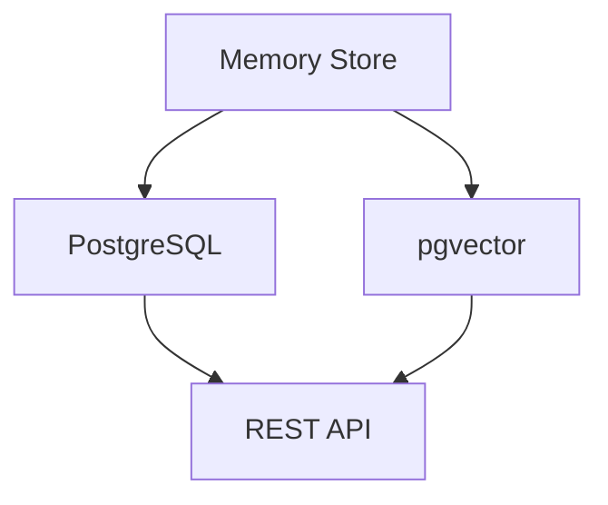
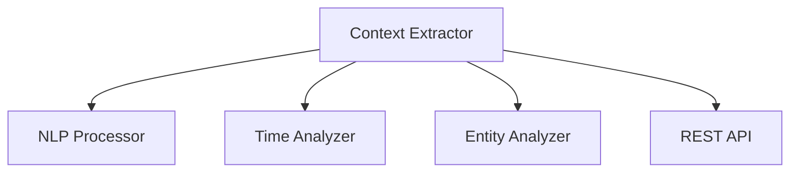
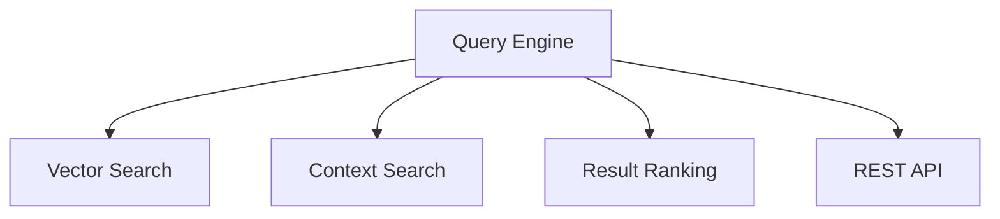
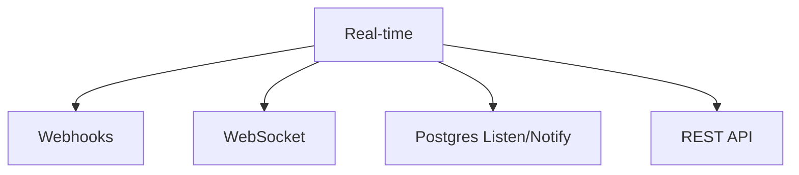
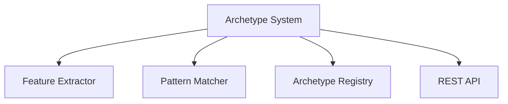
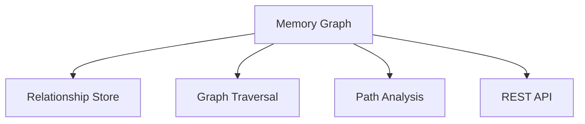
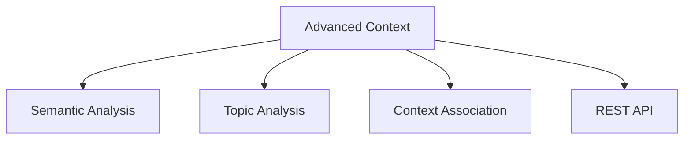
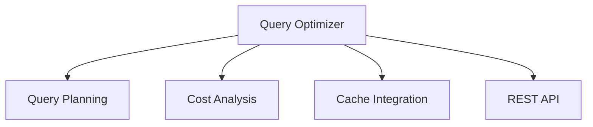

# Iterative Implementation Plan

Each phase delivers a testable, functional component that can be validated independently. This allows us to build incrementally while ensuring quality and functionality at each step.

## Phase 1: Core Memory Storage (1-2 weeks)
### Goal: Basic memory storage and retrieval with vector search

1. **Basic Memory Storage** (2-3 days)


- [x] Set up PostgreSQL with pgvector
- [ ] Create basic memory table schema
- [ ] Implement CRUD operations
- [ ] Add vector storage capabilities
- [ ] Create REST API endpoints

**Success Criteria:**
- Store and retrieve memories with metadata
- Perform basic vector similarity search
- REST API returns correct results
- All unit tests pass

**Test Suite:**
```python
class TestMemoryStorage:
    async def test_create_memory(self):
        memory = await create_memory("Test content")
        assert memory.id is not None
        
    async def test_vector_search(self):
        results = await search_similar("Test query")
        assert len(results) > 0
```

## Phase 2: Context Engine Core (1-2 weeks)
### Goal: Extract and store context from memories

1. **Context Extraction** (3-4 days)


- [ ] Implement basic NLP processing
- [ ] Add temporal context extraction
- [ ] Add entity recognition
- [ ] Create context storage schema
- [ ] Add context API endpoints

**Success Criteria:**
- Extract meaningful context from text
- Store and retrieve context
- Link context to memories
- All context tests pass

**Test Suite:**
```python
class TestContextExtraction:
    async def test_extract_context(self):
        context = await extract_context("Meeting tomorrow at 2pm")
        assert context.temporal is not None
        assert context.entities is not None
```

## Phase 3: Basic Query Engine (1-2 weeks)
### Goal: Search memories using context and vectors

1. **Query Processing** (3-4 days)


- [ ] Implement query parser
- [ ] Add vector similarity search
- [ ] Add context-based filtering
- [ ] Create result ranking
- [ ] Add query API endpoints

**Success Criteria:**
- Execute combined vector and context queries
- Rank results by relevance
- Return paginated results
- All query tests pass

**Test Suite:**
```python
class TestQueryEngine:
    async def test_combined_search(self):
        results = await search(
            text="project meeting",
            context="work",
            limit=10
        )
        assert len(results) <= 10
```

## Phase 4: Real-time Integration (1 week)
### Goal: Add real-time updates and webhooks

1. **Real-time Updates** (2-3 days)


- [ ] Set up Supabase real-time
- [ ] Add WebSocket support
- [ ] Implement webhook system
- [ ] Create notification schema

**Success Criteria:**
- Real-time updates on memory changes
- Webhook notifications work
- WebSocket connections maintain state
- All real-time tests pass

**Test Suite:**
```python
class TestRealtime:
    async def test_websocket_updates(self):
        async with websocket_client() as ws:
            memory = await create_memory("Test")
            update = await ws.receive_json()
            assert update.memory_id == memory.id
```

## Phase 5: Basic Archetype System (1-2 weeks)
### Goal: Implement basic memory pattern recognition

1. **Pattern Recognition** (3-4 days)


- [ ] Create feature extractors
- [ ] Implement pattern matching
- [ ] Add archetype storage
- [ ] Create archetype API endpoints

**Success Criteria:**
- Extract features from memories
- Match memories to archetypes
- Update archetypes based on new memories
- All archetype tests pass

**Test Suite:**
```python
class TestArchetypes:
    async def test_pattern_matching(self):
        memory = await create_memory("Test pattern")
        matches = await find_matching_archetypes(memory)
        assert len(matches) > 0
```

## Phase 6: Memory Graph (1-2 weeks)
### Goal: Add relationship management between memories

1. **Graph Operations** (3-4 days)


- [ ] Create relationship schema
- [ ] Add graph operations
- [ ] Implement path finding
- [ ] Create graph API endpoints

**Success Criteria:**
- Create and traverse relationships
- Find paths between memories
- Query related memories
- All graph tests pass

**Test Suite:**
```python
class TestMemoryGraph:
    async def test_relationships(self):
        memory1 = await create_memory("First")
        memory2 = await create_memory("Second")
        rel = await create_relationship(memory1, memory2)
        assert rel is not None
```

## Phase 7: Advanced Context (1-2 weeks)
### Goal: Enhanced context understanding and processing

1. **Context Enhancement** (3-4 days)


- [ ] Add semantic analysis
- [ ] Implement topic extraction
- [ ] Add context relationships
- [ ] Enhance context API

**Success Criteria:**
- Extract semantic meaning
- Identify topics and themes
- Link related contexts
- All advanced context tests pass

**Test Suite:**
```python
class TestAdvancedContext:
    async def test_semantic_analysis(self):
        context = await analyze_semantics("Complex topic")
        assert context.topics is not None
        assert context.semantic_vector is not None
```

## Phase 8: Query Optimization (1 week)
### Goal: Improve query performance and capabilities

1. **Query Enhancement** (2-3 days)


- [ ] Add query planning
- [ ] Implement query optimization
- [ ] Add result caching
- [ ] Enhance query API

**Success Criteria:**
- Improved query performance
- Efficient execution plans
- Effective result caching
- All optimization tests pass

**Test Suite:**
```python
class TestQueryOptimization:
    async def test_query_performance(self):
        start = time.time()
        results = await optimized_search("test")
        duration = time.time() - start
        assert duration < 0.1
```

## Integration Testing

Each phase includes integration tests that verify the component works with existing functionality:

```python
class TestIntegration:
    async def test_end_to_end(self):
        # Create memory
        memory = await create_memory("Test integration")
        
        # Extract context
        context = await extract_context(memory.content)
        
        # Search with context
        results = await search(
            text="test",
            context=context.id
        )
        
        # Verify real-time update
        async with websocket_client() as ws:
            update = await ws.receive_json()
            assert update.type == "memory.created"
            
        # Check archetype matching
        matches = await find_matching_archetypes(memory)
        
        # Verify relationships
        related = await find_related_memories(memory.id)
```

## Development Workflow

1. **For each task:**
   - Write tests first
   - Implement functionality
   - Verify tests pass
   - Document changes
   - Review code

2. **Before moving to next phase:**
   - All tests must pass
   - Integration tests must pass
   - Performance metrics must meet targets
   - Documentation must be updated

3. **Continuous Integration:**
   - Automated test runs
   - Performance monitoring
   - Code quality checks
   - Documentation updates

## Monitoring and Metrics

Each phase includes monitoring setup:

```python
METRICS = {
    'memory': {
        'creation_rate': 'memories/second',
        'storage_size': 'bytes',
        'retrieval_latency': 'ms'
    },
    'context': {
        'extraction_rate': 'contexts/second',
        'accuracy': 'percentage',
        'processing_time': 'ms'
    },
    'query': {
        'throughput': 'queries/second',
        'latency': 'ms',
        'cache_hit_ratio': 'percentage'
    }
}
```

## Rollback Plan

Each phase includes rollback procedures:

```python
async def rollback_phase(phase_number: int):
    # Revert database changes
    await revert_migrations(phase_number)
    
    # Restore previous version
    await deploy_version(get_previous_version())
    
    # Verify system health
    assert await check_system_health()
```

This implementation plan ensures:
- Each component is testable independently
- Integration is verified at each step
- Performance is monitored continuously
- Rollback is possible if needed
- Documentation stays current

Would you like me to detail any specific phase or create the test suites for a particular component?
