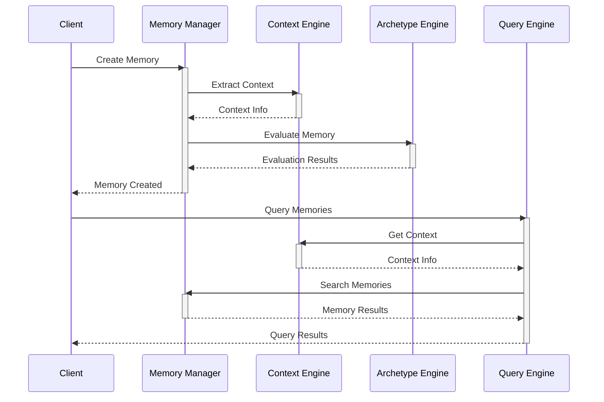
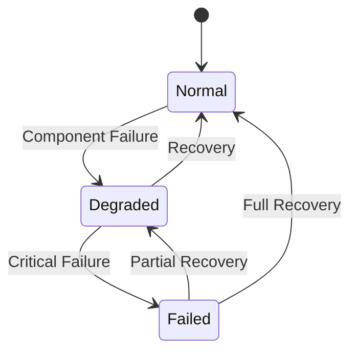

# Core Components

## Overview

EUMAS is composed of several core components that work together to provide a comprehensive memory management system:

```mermaid
graph TD
    subgraph Memory Management
        MM[Memory Manager]
        VE[Vector Engine]
        GE[Graph Engine]
    end

    subgraph Context System
        CE[Context Engine]
        CA[Context Analyzer]
        CP[Context Processor]
    end

    subgraph Archetype System
        AE[Archetype Engine]
        AM[Archetype Metrics]
        AS[Archetype State]
    end

    subgraph Query System
        QE[Query Engine]
        QP[Query Planner]
        QO[Query Optimizer]
    end

    MM --> VE
    MM --> GE
    CE --> CA
    CE --> CP
    AE --> AM
    AE --> AS
    QE --> QP
    QE --> QO

    MM --> CE
    CE --> AE
    AE --> QE
</graph>
```

## Component Documentation

### Core Systems
- [Memory Management](memory.md): Memory creation, storage, and retrieval
- [Context Engine](context.md): Context processing and analysis
- [Archetype System](archetypes.md): Memory evaluation and classification
- [Query Engine](query.md): Memory search and retrieval optimization

### Supporting Systems
- [Vector Engine](vector-engine.md): Embedding generation and similarity search
- [Graph Engine](graph-engine.md): Relationship management and traversal
- [Analytics Engine](analytics.md): System monitoring and performance analysis

## Component Interaction

### Data Flow


## Performance Considerations

### Resource Usage
- Memory allocation and caching strategies
- Batch processing optimization
- Connection pooling
- Query optimization

### Scalability
- Horizontal scaling of components
- Load balancing
- Partitioning strategies
- Caching layers

## Error Handling

### Resilience Patterns


### Recovery Strategies
- Circuit breakers
- Fallback mechanisms
- Retry policies
- Graceful degradation

## Monitoring

### Key Metrics
- Component health
- Response times
- Error rates
- Resource utilization

### Alerting
- Component failures
- Performance degradation
- Resource exhaustion
- Error thresholds

## Configuration

### Environment Variables
```bash
# Component Configuration
MEMORY_CACHE_SIZE=1000
CONTEXT_BATCH_SIZE=50
ARCHETYPE_UPDATE_INTERVAL=300
QUERY_TIMEOUT=30

# Resource Limits
MAX_CONNECTIONS=100
MAX_POOL_SIZE=20
BATCH_SIZE=50
```

### Feature Flags
```python
FEATURES = {
    'enable_vector_cache': True,
    'use_batch_processing': True,
    'enable_real_time_updates': True,
    'use_query_optimization': True
}
```

## Integration Points

### External Services
- OpenAI API for embeddings
- PostgreSQL for storage
- Redis for caching
- Supabase for real-time updates

### Internal Communication
- Event bus
- Message queues
- WebSocket connections
- HTTP endpoints

## Development Guidelines

### Component Development
1. Follow single responsibility principle
2. Implement proper error handling
3. Add comprehensive logging
4. Include performance metrics
5. Write thorough documentation

### Testing Strategy
1. Unit tests for core logic
2. Integration tests for component interaction
3. Performance tests for scalability
4. End-to-end tests for workflows

## Further Reading
- [Implementation Guide](../IMPLEMENTATION.md)
- [API Documentation](../api/README.md)
- [Performance Tuning](../optimization/README.md)
- [Troubleshooting Guide](../troubleshooting/README.md)
