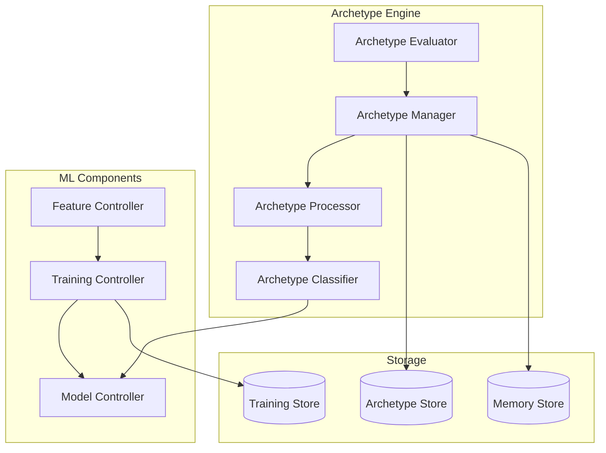
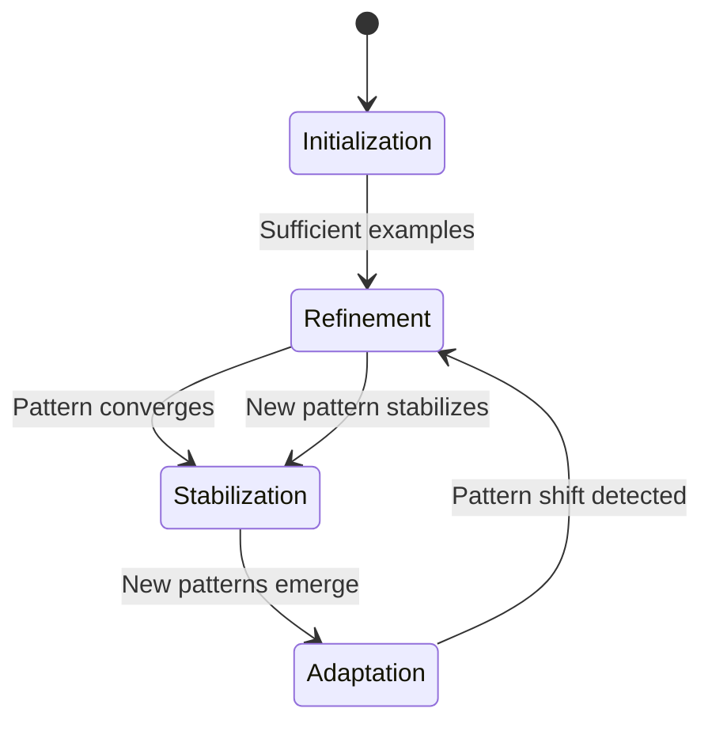

# Archetype System

## Overview

The Archetype System classifies and manages memory patterns, enabling efficient organization and retrieval of related memories. It uses machine learning and pattern recognition to identify common structures and relationships in memory data.

## Architecture



## Archetype Structure

### Archetype Object
```typescript
interface Archetype {
    id: string;
    name: string;
    pattern: {
        features: Feature[];
        weights: number[];
        threshold: number;
    };
    metadata: {
        created_at: timestamp;
        updated_at: timestamp;
        version: string;
        confidence: number;
    };
    metrics: {
        usage_count: number;
        success_rate: number;
        average_confidence: number;
    };
    relationships: {
        parent_id?: string;
        child_ids: string[];
        related_ids: string[];
    };
    parameters: {
        classification?: {
            model_type: string;
            model_parameters: any;
        };
        evaluation?: {
            metrics: string[];
            thresholds: Record<string, number>;
        };
    };
}

interface Feature {
    name: string;
    type: FeatureType;
    extractor: string;
    parameters: any;
}

enum FeatureType {
    SEMANTIC,
    STRUCTURAL,
    TEMPORAL,
    BEHAVIORAL,
    CUSTOM
}
```

## Core Operations

### Archetype Classification
```python
async def classify_memory(
    memory: Memory,
    threshold: float = 0.7
) -> List[ArchetypeMatch]:
    # Extract features
    features = await feature_extractor.extract(memory)
    
    # Get candidate archetypes
    candidates = await get_candidate_archetypes(features)
    
    # Evaluate each candidate
    matches = []
    for archetype in candidates:
        confidence = await evaluate_archetype_match(
            archetype, features
        )
        if confidence >= threshold:
            matches.append(ArchetypeMatch(
                archetype=archetype,
                confidence=confidence
            ))
    
    return sorted(matches, key=lambda m: m.confidence,
                 reverse=True)
```

### Archetype Learning
```python
async def train_archetype(
    memories: List[Memory],
    name: str = None
) -> Archetype:
    # Extract common features
    features = await extract_common_features(memories)
    
    # Learn pattern weights
    weights = await learn_pattern_weights(features)
    
    # Create archetype
    archetype = Archetype(
        name=name or generate_archetype_name(features),
        pattern={
            'features': features,
            'weights': weights,
            'threshold': calculate_threshold(weights)
        },
        metadata={
            'version': '1.0',
            'confidence': calculate_confidence(weights)
        }
    )
    
    # Store archetype
    await store_archetype(archetype)
    
    return archetype
```

## Pattern Recognition

### Feature Extraction
```python
class FeatureExtractor:
    async def extract(self, memory: Memory) -> Features:
        # Extract semantic features
        semantic = await self.extract_semantic_features(
            memory.content
        )
        
        # Extract structural features
        structural = await self.extract_structural_features(
            memory.relationships
        )
        
        # Extract temporal features
        temporal = await self.extract_temporal_features(
            memory.metadata
        )
        
        return Features(
            semantic=semantic,
            structural=structural,
            temporal=temporal
        )
```

### Pattern Matching
```python
class PatternMatcher:
    async def match(
        self,
        features: Features,
        archetype: Archetype
    ) -> float:
        # Calculate feature similarities
        similarities = []
        for feature, weight in zip(
            archetype.pattern.features,
            archetype.pattern.weights
        ):
            similarity = await self.calculate_similarity(
                features[feature.name],
                feature
            )
            similarities.append(similarity * weight)
        
        # Calculate overall match score
        return sum(similarities) / sum(archetype.pattern.weights)
```

## Archetype Management

### Archetype Storage
```python
async def store_archetype(
    archetype: Archetype,
    batch: bool = False
) -> str:
    if batch:
        return await archetype_store.batch_insert([archetype])
    
    # Store archetype
    archetype_id = await archetype_store.insert(archetype)
    
    # Update indexes
    await update_archetype_indexes(archetype)
    
    # Notify subscribers
    await notify_archetype_change(archetype)
    
    return archetype_id
```

### Archetype Evolution
```python
async def evolve_archetype(
    archetype: Archetype,
    new_memories: List[Memory]
) -> Archetype:
    # Extract features from new memories
    new_features = await extract_features_batch(new_memories)
    
    # Update pattern weights
    updated_weights = await update_pattern_weights(
        archetype.pattern.weights,
        new_features
    )
    
    # Create evolved archetype
    evolved = Archetype(
        **archetype,
        pattern={
            **archetype.pattern,
            'weights': updated_weights,
            'threshold': calculate_threshold(updated_weights)
        },
        metadata={
            **archetype.metadata,
            'version': increment_version(archetype.metadata.version),
            'updated_at': datetime.now()
        }
    )
    
    # Store evolved archetype
    await store_archetype(evolved)
    
    return evolved
```

## Optimization

### Caching Strategy
```python
ARCHETYPE_CACHE_CONFIG = {
    'max_size': 100,
    'ttl': 3600,
    'update_interval': 300
}

class ArchetypeCache:
    async def get_or_compute(
        self,
        key: str,
        computer: Callable
    ) -> Archetype:
        # Check cache
        cached = await self.get(key)
        if cached:
            return cached
        
        # Compute if not found
        result = await computer()
        
        # Cache result
        await self.set(key, result)
        
        return result
```

### Batch Processing
```python
async def batch_classify_memories(
    memories: List[Memory],
    batch_size: int = 50
) -> Dict[str, List[ArchetypeMatch]]:
    results = {}
    for batch in chunks(memories, batch_size):
        # Classify batch in parallel
        classifications = await asyncio.gather(*[
            classify_memory(memory)
            for memory in batch
        ])
        for memory, matches in zip(batch, classifications):
            results[memory.id] = matches
    return results
```

## Error Handling

### Recovery Mechanisms
```python
class ArchetypeError(Exception):
    pass

async def safe_archetype_operation(
    operation: Callable,
    *args,
    **kwargs
):
    try:
        return await operation(*args, **kwargs)
    except ClassificationError:
        # Handle classification failures
        await fallback_classification()
    except StorageError:
        # Handle storage failures
        await recover_archetype_store()
    except TrainingError:
        # Handle training failures
        await retry_training()
    raise ArchetypeError("Failed to complete archetype operation")
```

## Monitoring

### Key Metrics
```python
ARCHETYPE_METRICS = {
    'classification_rate': 'memories_classified/second',
    'training_duration': 'seconds',
    'evolution_frequency': 'evolutions/day',
    'match_confidence': 'percentage'
}

async def monitor_archetype_system():
    return {
        'classification': await monitor_classification(),
        'training': await monitor_training(),
        'evolution': await monitor_evolution(),
        'storage': await monitor_storage()
    }
```

## Configuration

### Environment Variables
```bash
# Classification Configuration
MODEL_TYPE=transformer
FEATURE_EXTRACTORS=["semantic", "structural", "temporal"]
CONFIDENCE_THRESHOLD=0.7

# Training Configuration
MIN_TRAINING_SAMPLES=100
MAX_ITERATIONS=1000
LEARNING_RATE=0.01

# Evolution Configuration
EVOLUTION_INTERVAL=86400
MIN_NEW_SAMPLES=50
```

## Integration

### Event System
```python
@archetype_events.on('archetype.evolved')
async def handle_archetype_evolved(
    old_archetype: Archetype,
    new_archetype: Archetype
):
    # Update indexes
    await update_archetype_indexes(new_archetype)
    
    # Reclassify affected memories
    await reclassify_memories(old_archetype.id)
    
    # Update analytics
    await update_archetype_metrics(new_archetype)
```

## Development Guidelines

### Best Practices
1. Validate input memories before classification
2. Use batch operations for multiple memories
3. Implement proper error handling
4. Monitor classification metrics
5. Regular archetype maintenance

### Testing
```python
async def test_archetype_classification():
    # Test basic classification
    memory = create_test_memory()
    matches = await classify_memory(memory)
    assert len(matches) > 0
    
    # Test confidence threshold
    high_confidence_matches = [
        m for m in matches
        if m.confidence >= 0.9
    ]
    assert len(high_confidence_matches) > 0
    
    # Test archetype evolution
    evolved = await evolve_archetype(
        matches[0].archetype,
        [memory]
    )
    assert evolved.metadata.version > matches[0].archetype.metadata.version
```

## Archetype State

The Archetype State represents the dynamic, evolving nature of memory patterns in EUMAS. It maintains the current state of each archetype, including:

### State Components
```typescript
interface ArchetypeState {
    id: string;
    archetype_id: string;
    current_state: {
        active: boolean;
        strength: number;  // 0.0 to 1.0
        stability: number; // How resistant to change
        plasticity: number; // How adaptable to new patterns
    };
    activation_history: {
        timestamps: timestamp[];
        contexts: string[];
        success_rates: number[];
    };
    learning_state: {
        training_phase: TrainingPhase;
        learning_rate: number;
        last_update: timestamp;
        samples_since_update: number;
    };
    adaptation_metrics: {
        drift_rate: number;      // How quickly pattern is changing
        coherence_score: number; // How well-defined the pattern is
        novelty_score: number;   // How unique compared to other archetypes
    };
}

enum TrainingPhase {
    INITIALIZATION,  // Initial pattern formation
    REFINEMENT,     // Fine-tuning with new examples
    STABILIZATION,  // Pattern has matured
    ADAPTATION      // Actively adapting to new patterns
}
```

### State Transitions


### State Management
```python
class ArchetypeStateManager:
    async def update_state(self, state: ArchetypeState, memory: Memory):
        # Update activation history
        state.activation_history.timestamps.append(datetime.now())
        state.activation_history.contexts.append(memory.context)
        
        # Calculate success rate
        success = await self.evaluate_match(state, memory)
        state.activation_history.success_rates.append(success)
        
        # Update strength and stability
        state.current_state.strength = self.calculate_strength(
            state.activation_history
        )
        state.current_state.stability = self.calculate_stability(
            state.activation_history
        )
        
        # Adjust learning parameters
        await self.adapt_learning_rate(state)
        
        # Check for phase transitions
        await self.check_phase_transition(state)
```

### Adaptation Mechanisms

1. **Pattern Strength**
   - Increases with successful matches
   - Decays over time without activation
   - Influences pattern matching threshold

2. **Stability vs Plasticity**
   - Stability increases with consistent matches
   - Plasticity allows adaptation to new patterns
   - Balance determines learning rate

3. **Phase Transitions**
   - Triggered by pattern consistency
   - Affects learning rate and threshold
   - Determines adaptation behavior

### Usage Example
```python
async def handle_memory_activation(
    memory: Memory,
    archetype: Archetype
):
    # Get current state
    state = await state_manager.get_state(archetype.id)
    
    # Update state based on memory
    await state_manager.update_state(state, memory)
    
    # Check for adaptation needs
    if state.adaptation_metrics.drift_rate > DRIFT_THRESHOLD:
        await archetype_manager.adapt_pattern(
            archetype,
            state
        )
    
    # Update learning parameters
    if state.learning_state.training_phase == TrainingPhase.ADAPTATION:
        await adjust_learning_parameters(
            archetype,
            state
        )
```

### Monitoring and Analysis

1. **Pattern Health Metrics**
   ```python
   async def analyze_pattern_health(state: ArchetypeState):
       return {
           'strength': state.current_state.strength,
           'stability': state.current_state.stability,
           'coherence': state.adaptation_metrics.coherence_score,
           'drift': state.adaptation_metrics.drift_rate
       }
   ```

2. **Learning Progress**
   ```python
   async def track_learning_progress(state: ArchetypeState):
       return {
           'phase': state.learning_state.training_phase,
           'samples': state.learning_state.samples_since_update,
           'learning_rate': state.learning_state.learning_rate,
           'success_rate': calculate_success_rate(
               state.activation_history
           )
       }
   ```

The Archetype State system ensures that patterns:
- Evolve naturally with new experiences
- Maintain stability when well-established
- Adapt to significant changes
- Balance consistency with flexibility

## Further Reading
- [Memory Management](memory.md)
- [Context Engine](context.md)
- [Query Engine](query.md)
- [Machine Learning](../ml/README.md)
