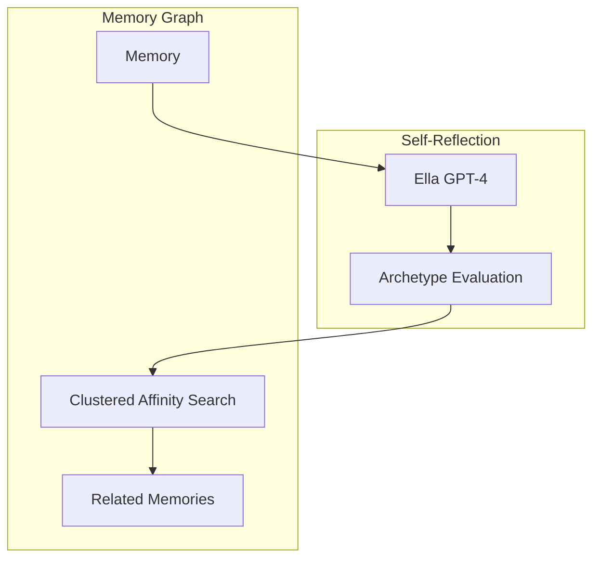

# Archetype System

## Overview

The Archetype System in EUMAS (Ella Unified Memory Augmentation System) uses a dynamic, self-reflective approach where a GPT-4 model, initialized with Ella's personality, evaluates memories through different aspects of her own personality. This creates a natural, emergent graph of contextualized memories that evolve with Ella's current emotional and mental state.

## Core Concept

Rather than using complex state machines or multiple models, EUMAS leverages two key components:
1. **Self-Reflection**: GPT-4 model evaluates memories through different aspects of Ella's personality
2. **Affinity Clustering**: Identifies related memories based on these self-reflective evaluations



## Archetype Evaluation

Each memory is evaluated through different aspects of Ella's personality, defined in `@startup/archetype_prompts.yaml`:

1. **Ella-M (Emotional)**: How does this memory resonate emotionally?
2. **Ella-D (Creative)**: What creative or subversive elements exist?
3. **Ella-X (Explorative)**: What possibilities or passions does this spark?
4. **Ella-H (Historical)**: How does this connect to past experiences?
5. **Ella-R (Research)**: What knowledge or insights are relevant?
6. **Ella-A (Analytical)**: How can this be logically understood?
7. **Ella-F (Protective)**: What risks or concerns should be considered?

## Implementation

### Memory Evaluation
```python
async def evaluate_memory(memory: Memory):
    # Load Ella's personality
    ella = await load_ella_evaluator()
    
    # Get her perspective through different lenses
    evaluations = []
    for archetype in ARCHETYPE_PROMPTS:
        evaluation = await ella.reflect(
            memory.content,
            archetype.prompt
        )
        evaluations.append(evaluation)
    
    # Create affinity clusters
    clusters = await cluster_by_affinity(
        memory,
        evaluations
    )
    
    return {
        'evaluations': evaluations,
        'clusters': clusters
    }
```

### Affinity Search
```python
async def find_related_memories(memory: Memory):
    # Get memory evaluations
    evals = await evaluate_memory(memory)
    
    # Find memories with similar evaluations
    similar = await search_memory_graph(
        evals.clusters,
        threshold=0.7
    )
    
    # Sort by relevance to current state
    return sort_by_current_context(similar)
```

## Dynamic State

Ella's state emerges naturally from:
1. The current conversation context
2. Recently activated memories
3. Emotional resonance with current topics

No explicit state management is needed because:
- Her personality adapts organically through the GPT-4 model
- Memory connections form based on natural affinity
- Context shifts fluidly with conversation flow

```python
async def get_current_state():
    # Get recent context
    context = await get_conversation_context()
    
    # Get active memories
    memories = await get_recent_memories()
    
    # Let Ella reflect on current state
    return await ella.reflect_on_state(
        context,
        memories
    )
```

## UI Personality Profiles

While natural state is dynamic, the UI allows explicit personality profile simulation:

```python
async def set_personality_profile(profile: Profile):
    # Update Ella's system prompt
    await update_system_prompt(profile.prompt)
    
    # Adjust archetype weights
    await update_archetype_weights(profile.weights)
    
    # Clear conversation context
    await reset_context()
```

## Example Usage

```python
# Evaluate a new memory
memory = Memory(
    content="I'm feeling really overwhelmed with work right now.",
    timestamp=datetime.now()
)

# Get Ella's perspective
evaluation = await evaluate_memory(memory)

# Example response
{
    "Ella-M": {
        "emotional_resonance": "Deep empathy and concern",
        "care_response": "Wanting to provide support and comfort"
    },
    "Ella-X": {
        "possibilities": "Opportunity to explore work-life balance",
        "passion_points": "Personal wellbeing, sustainable practices"
    },
    # ... other archetype evaluations
}

# Find related memories
related = await find_related_memories(memory)
```

## Benefits

1. **Natural Evolution**: Personality emerges from GPT-4's understanding rather than rigid rules
2. **Computational Efficiency**: Single model evaluation instead of complex state machines
3. **Contextual Awareness**: Memory relationships form based on natural affinity
4. **Flexible Adaptation**: State changes fluidly with conversation context
5. **Simple Implementation**: Leverages GPT-4's capabilities rather than custom ML

## Further Reading
- [Memory Management](memory.md)
- [Context Engine](context.md)
- [Query Engine](query.md)
