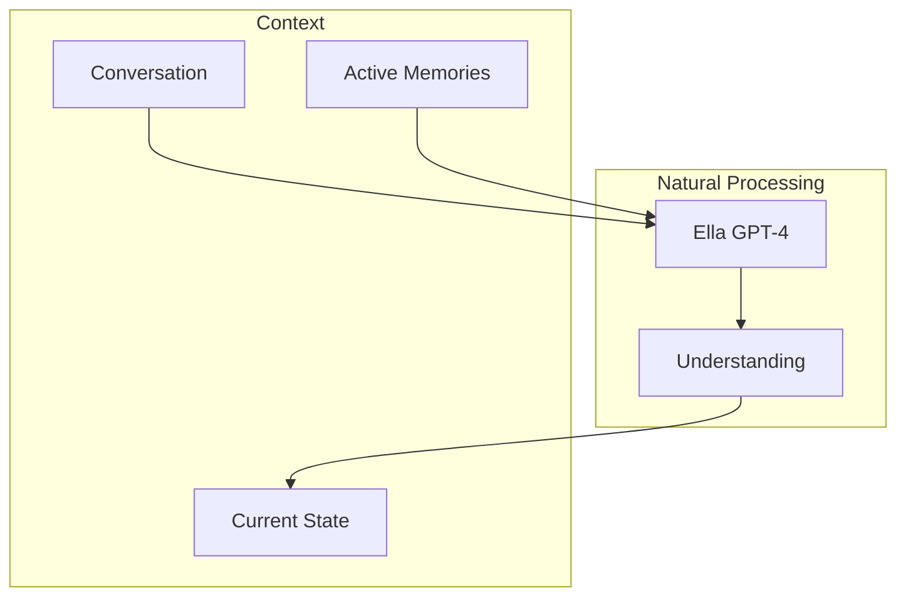

# Context Engine

## Overview

The Context Engine uses GPT-4's natural understanding to maintain Ella's awareness of the current conversation, active memories, and emotional state. Instead of complex analyzers and processors, it relies on Ella's ability to comprehend and maintain context naturally.

## Core Concepts

### Natural Context Flow


### Context Structure
```python
@dataclass
class Context:
    # Current conversation
    messages: List[Dict[str, any]]
    
    # Active memories
    memories: List[Memory]
    
    # Ella's state
    emotional_state: Dict[str, any]
    focus_areas: List[str]
    active_archetypes: List[str]
```

## Implementation

### 1. Context Maintenance
```python
class ContextEngine:
    async def update_context(self, message: str) -> Context:
        # Add message to conversation
        self.messages.append({
            'content': message,
            'timestamp': datetime.now()
        })
        
        # Let Ella understand the context
        understanding = await self.ella.understand_context(
            messages=self.messages[-10:],  # Recent messages
            memories=await self.get_active_memories()
        )
        
        # Update current state
        self.context = Context(
            messages=self.messages[-10:],
            memories=understanding.relevant_memories,
            emotional_state=understanding.emotional_state,
            focus_areas=understanding.focus_areas,
            active_archetypes=understanding.active_archetypes
        )
        
        return self.context
```

### 2. Memory Activation
```python
class ContextEngine:
    async def get_active_memories(self) -> List[Memory]:
        # Get recent memories
        recent = await self.db.get_recent_memories(limit=5)
        
        # Get emotionally relevant memories
        emotional = await self.find_emotional_memories()
        
        # Get contextually relevant memories
        contextual = await self.find_contextual_memories()
        
        # Let Ella choose most relevant ones
        return await self.ella.select_relevant_memories(
            recent + emotional + contextual
        )
```

### 3. State Management
```python
class ContextEngine:
    async def get_current_state(self) -> Dict:
        # Let Ella reflect on current state
        return await self.ella.reflect_on_state(
            context=self.context,
            personality=self.personality
        )
    
    async def set_personality(self, profile: str):
        # Update Ella's personality profile
        self.personality = profile
        await self.ella.adapt_personality(profile)
```

## Storage

### Database Schema
```sql
-- Active context
CREATE TABLE active_context (
    id UUID PRIMARY KEY,
    timestamp TIMESTAMPTZ NOT NULL,
    messages JSONB[],
    active_memories UUID[],
    state JSONB
);

-- Context history
CREATE TABLE context_history (
    id UUID PRIMARY KEY,
    context_id UUID REFERENCES active_context(id),
    timestamp TIMESTAMPTZ NOT NULL,
    snapshot JSONB
);
```

## Example Usage

### Maintaining Context
```python
# Update context with new message
context = await context_engine.update_context(
    "I'm feeling happy today!"
)

# View current state
print(context.emotional_state)
# {
#     "mood": "positive",
#     "energy": "high",
#     "focus": "personal wellbeing"
# }

# View active memories
for memory in context.memories:
    print(f"{memory.content} (relevance: {memory.relevance})")
# "Had a great day at the park" (relevance: 0.9)
# "The sun is shining" (relevance: 0.8)
```

### Personality Adaptation
```python
# Switch personality profile
await context_engine.set_personality("empathetic")

# Get adapted state
state = await context_engine.get_current_state()
print(state)
# {
#     "primary_aspect": "emotional",
#     "response_style": "supportive",
#     "focus": "user wellbeing"
# }
```

## Benefits

1. **Natural Understanding**: Uses GPT-4's comprehension for context
2. **Dynamic State**: Context flows naturally with conversation
3. **Memory Integration**: Seamlessly connects relevant memories
4. **Flexible Personality**: Adapts behavior through different profiles
5. **Simple Implementation**: No complex analyzers or processors
