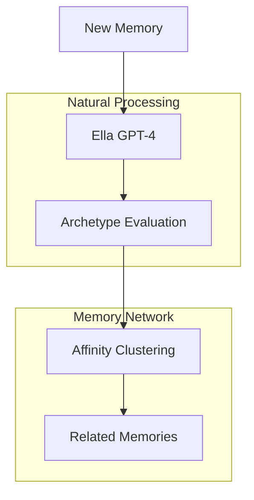

# Memory Management

## Overview

The Memory Management system in EUMAS uses GPT-4's natural understanding to create a dynamic network of interconnected memories. Instead of complex state machines or multiple storage systems, it relies on Ella's ability to evaluate and connect memories through different aspects of her personality.

## Core Concepts

### Memory Formation


### Memory Structure
```python
@dataclass
class Memory:
    # Core content
    id: UUID
    content: str
    timestamp: datetime
    
    # Ella's understanding
    evaluations: List[Dict[str, any]]
    context: Dict[str, any]
    
    # Natural connections
    affinities: List[Dict[str, any]]
```

## Implementation

### 1. Memory Creation
```python
class MemoryManager:
    async def create_memory(self, content: str) -> Memory:
        # Create new memory
        memory = Memory(
            content=content,
            timestamp=datetime.now()
        )
        
        # Let Ella evaluate it
        memory.evaluations = await self.evaluate_memory(memory)
        
        # Get current context
        memory.context = await self.get_current_context()
        
        # Find natural connections
        memory.affinities = await self.find_affinities(memory)
        
        # Store in database
        await self.store_memory(memory)
        
        return memory
```

### 2. Memory Retrieval
```python
class MemoryManager:
    async def find_memories(
        self,
        query: str,
        context: Dict = None
    ) -> List[Memory]:
        # Get Ella's understanding
        understanding = await self.ella.understand_query(query)
        
        # Find relevant memories
        memories = await self.db.search(
            query=understanding,
            context=context or await self.get_current_context()
        )
        
        # Sort by natural relevance
        return self.sort_by_relevance(memories)
```

### 3. Memory Network
```python
class MemoryManager:
    async def find_affinities(self, memory: Memory) -> List[Dict]:
        # Get Ella's perspective on relationships
        affinities = await self.ella.find_connections(
            memory,
            await self.get_recent_memories()
        )
        
        # Create weighted links
        for affinity in affinities:
            await self.db.create_link(
                source=memory.id,
                target=affinity.memory_id,
                weight=affinity.strength
            )
        
        return affinities
```

## Storage

### Database Schema
```sql
-- Memories table
CREATE TABLE memories (
    id UUID PRIMARY KEY,
    content TEXT NOT NULL,
    timestamp TIMESTAMPTZ NOT NULL,
    evaluations JSONB[],
    context JSONB
);

-- Natural connections
CREATE TABLE memory_links (
    source_id UUID REFERENCES memories(id),
    target_id UUID REFERENCES memories(id),
    weight FLOAT NOT NULL,
    PRIMARY KEY (source_id, target_id)
);

-- Efficient retrieval
CREATE INDEX ON memories USING GIN (context);
CREATE INDEX ON memories USING GIN (evaluations);
```

## Example Usage

### Creating a Memory
```python
# Create a new memory
memory = await memory_manager.create_memory(
    "I love how the sunset looks today!"
)

# View Ella's evaluations
print(memory.evaluations)
# [
#     {"type": "emotional", "value": "joy", "intensity": 0.8},
#     {"type": "creative", "value": "visual appreciation"},
#     {"type": "temporal", "value": "present moment"}
# ]

# View natural connections
print(memory.affinities)
# [
#     {"memory_id": "...", "strength": 0.9, "type": "similar experience"},
#     {"memory_id": "...", "strength": 0.7, "type": "shared emotion"}
# ]
```

### Finding Related Memories
```python
# Search for memories
memories = await memory_manager.find_memories(
    "What makes me happy?"
)

# Natural clustering of results
for memory in memories:
    print(f"{memory.content} (relevance: {memory.relevance})")
# "I love how the sunset looks today!" (relevance: 0.9)
# "Had a great time at the beach" (relevance: 0.8)
# "The garden is blooming!" (relevance: 0.7)
```

## Benefits

1. **Natural Understanding**: Uses GPT-4's comprehension instead of rigid rules
2. **Flexible Connections**: Memories link based on natural affinities
3. **Context Awareness**: Every operation considers the current conversation state
4. **Simple Implementation**: No complex state machines or multiple models
5. **Efficient Storage**: Only stores what's needed for natural retrieval
