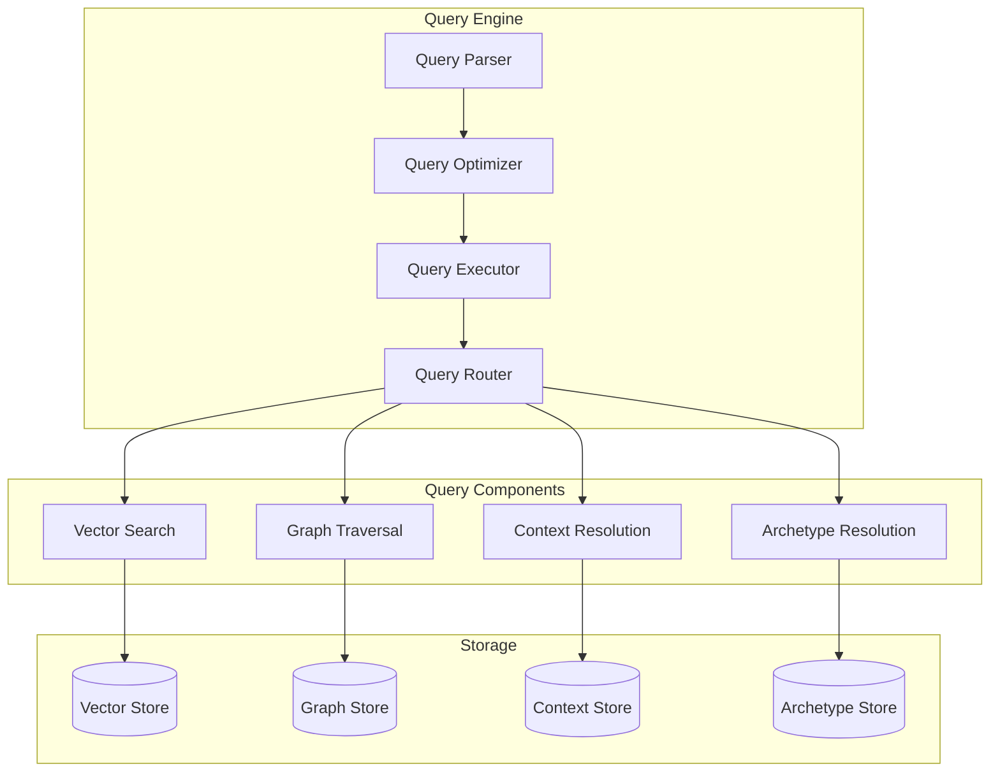

# Query Engine

## Overview

The Query Engine provides sophisticated memory search and retrieval capabilities, combining vector similarity, graph traversal, and contextual relevance to deliver accurate results. It optimizes query execution through intelligent planning and caching.

## Architecture



## Query Structure

### Query Object
```typescript
interface Query {
    id: string;
    type: QueryType;
    parameters: {
        text?: string;
        vector?: number[];
        context?: string;
        archetype?: string;
        filters?: Filter[];
        options?: QueryOptions;
    };
    metadata: {
        created_at: timestamp;
        timeout: number;
        max_results: number;
    };
}

interface Filter {
    field: string;
    operator: FilterOperator;
    value: any;
}

interface QueryOptions {
    include_metadata: boolean;
    include_context: boolean;
    include_relationships: boolean;
    ranking_method: RankingMethod;
}

enum QueryType {
    SEMANTIC,
    STRUCTURAL,
    TEMPORAL,
    HYBRID
}

enum FilterOperator {
    EQUALS,
    CONTAINS,
    GREATER_THAN,
    LESS_THAN,
    IN,
    NOT_IN
}

enum RankingMethod {
    RELEVANCE,
    RECENCY,
    IMPORTANCE,
    CUSTOM
}
```

## Core Operations

### Query Execution
```python
async def execute_query(
    query: Query,
    timeout: float = 30.0
) -> QueryResult:
    # Parse and validate query
    parsed_query = await query_parser.parse(query)
    
    # Generate query plan
    plan = await query_optimizer.optimize(parsed_query)
    
    # Execute query plan
    async with QueryContext(timeout=timeout) as ctx:
        results = await query_executor.execute(plan, ctx)
    
    # Rank and format results
    ranked_results = await rank_results(
        results,
        method=query.parameters.options.ranking_method
    )
    
    return QueryResult(
        query_id=query.id,
        results=ranked_results,
        metadata=generate_result_metadata(results)
    )
```

### Query Planning
```python
class QueryPlanner:
    async def plan_query(
        self,
        query: Query
    ) -> QueryPlan:
        # Analyze query components
        components = self.analyze_query_components(query)
        
        # Estimate component costs
        costs = await self.estimate_component_costs(
            components
        )
        
        # Generate execution plan
        plan = await self.generate_execution_plan(
            components,
            costs
        )
        
        return QueryPlan(
            steps=plan.steps,
            estimated_cost=plan.total_cost,
            parallelizable=plan.can_parallelize
        )
```

## Query Components

### Vector Search
```python
class VectorSearch:
    async def search(
        self,
        query_vector: List[float],
        limit: int = 10,
        threshold: float = 0.7
    ) -> List[SearchResult]:
        # Perform HNSW search
        results = await vector_store.search(
            query_vector,
            limit=limit,
            threshold=threshold
        )
        
        # Apply post-processing
        processed = await self.post_process_results(results)
        
        return processed
```

### Graph Traversal
```python
class GraphTraversal:
    async def traverse(
        self,
        start_nodes: List[str],
        traversal_spec: TraversalSpec
    ) -> List[TraversalResult]:
        # Initialize traversal
        visited = set()
        results = []
        
        # Perform traversal
        async for node in self.traverse_graph(
            start_nodes,
            traversal_spec
        ):
            if self.matches_criteria(node, traversal_spec):
                results.append(node)
            
            if len(results) >= traversal_spec.limit:
                break
        
        return results
```

## Query Optimization

### Cost-based Optimization
```python
class QueryOptimizer:
    async def optimize(
        self,
        query: Query
    ) -> OptimizedQuery:
        # Generate candidate plans
        candidates = self.generate_candidate_plans(query)
        
        # Estimate costs
        costs = await self.estimate_plan_costs(candidates)
        
        # Select best plan
        best_plan = self.select_best_plan(
            candidates,
            costs
        )
        
        return OptimizedQuery(
            plan=best_plan,
            estimated_cost=costs[best_plan.id]
        )
```

### Query Rewriting
```python
class QueryRewriter:
    async def rewrite(
        self,
        query: Query
    ) -> Query:
        # Apply transformation rules
        transformed = await self.apply_transformations(query)
        
        # Optimize conditions
        optimized = await self.optimize_conditions(
            transformed
        )
        
        # Validate rewritten query
        validated = await self.validate_query(optimized)
        
        return validated
```

## Result Processing

### Result Ranking
```python
async def rank_results(
    results: List[QueryResult],
    method: RankingMethod
) -> List[RankedResult]:
    if method == RankingMethod.RELEVANCE:
        return await rank_by_relevance(results)
    elif method == RankingMethod.RECENCY:
        return await rank_by_recency(results)
    elif method == RankingMethod.IMPORTANCE:
        return await rank_by_importance(results)
    else:
        return await rank_custom(results, method)
```

### Result Aggregation
```python
async def aggregate_results(
    results: List[QueryResult],
    aggregation: Aggregation
) -> AggregatedResult:
    # Group results
    groups = await group_results(
        results,
        aggregation.grouping
    )
    
    # Apply aggregation functions
    aggregated = await apply_aggregations(
        groups,
        aggregation.functions
    )
    
    return AggregatedResult(
        groups=aggregated,
        metadata=generate_aggregation_metadata(aggregated)
    )
```

## Optimization

### Query Cache
```python
QUERY_CACHE_CONFIG = {
    'max_size': 1000,
    'ttl': 300,
    'update_interval': 60
}

class QueryCache:
    async def get_or_execute(
        self,
        query: Query,
        executor: Callable
    ) -> QueryResult:
        # Generate cache key
        key = self.generate_cache_key(query)
        
        # Check cache
        cached = await self.get(key)
        if cached and not self.is_stale(cached, query):
            return cached
        
        # Execute query if not found
        result = await executor(query)
        
        # Cache result
        await self.set(key, result)
        
        return result
```

### Parallel Execution
```python
async def execute_parallel_query(
    query: Query,
    max_workers: int = 4
) -> QueryResult:
    # Split query into subqueries
    subqueries = split_query(query)
    
    # Execute subqueries in parallel
    async with QueryExecutionPool(max_workers) as pool:
        results = await pool.map(execute_query, subqueries)
    
    # Merge results
    merged = await merge_results(results)
    
    return merged
```

## Error Handling

### Recovery Mechanisms
```python
class QueryError(Exception):
    pass

async def safe_query_execution(
    query: Query,
    *args,
    **kwargs
):
    try:
        return await execute_query(query, *args, **kwargs)
    except QueryParseError:
        # Handle parsing failures
        await fallback_to_simple_query(query)
    except ExecutionError:
        # Handle execution failures
        await retry_with_timeout_extension(query)
    except OptimizationError:
        # Handle optimization failures
        await execute_unoptimized_query(query)
    raise QueryError("Failed to execute query")
```

## Monitoring

### Key Metrics
```python
QUERY_METRICS = {
    'execution_time': 'milliseconds',
    'result_count': 'count',
    'cache_hit_ratio': 'percentage',
    'optimization_savings': 'percentage'
}

async def monitor_query_system():
    return {
        'performance': await monitor_performance(),
        'cache': await monitor_cache(),
        'optimization': await monitor_optimization(),
        'errors': await monitor_errors()
    }
```

## Configuration

### Environment Variables
```bash
# Query Configuration
MAX_RESULTS=100
DEFAULT_TIMEOUT=30
CACHE_TTL=300

# Optimization Configuration
ENABLE_OPTIMIZATION=true
MAX_REWRITE_DEPTH=3
PARALLEL_EXECUTION=true

# Performance Configuration
MAX_WORKERS=4
BATCH_SIZE=50
```

## Integration

### Event System
```python
@query_events.on('query.executed')
async def handle_query_executed(
    query: Query,
    result: QueryResult
):
    # Update cache
    await update_query_cache(query, result)
    
    # Update statistics
    await update_query_statistics(query, result)
    
    # Notify subscribers
    await notify_query_subscribers(query, result)
```

## Development Guidelines

### Best Practices
1. Always validate queries before execution
2. Use query optimization when possible
3. Implement proper error handling
4. Monitor query performance
5. Use appropriate caching strategies

### Testing
```python
async def test_query_execution():
    # Test basic query
    query = create_test_query()
    result = await execute_query(query)
    assert len(result.results) > 0
    
    # Test query optimization
    optimized = await optimize_query(query)
    assert optimized.estimated_cost < query.estimated_cost
    
    # Test parallel execution
    parallel_result = await execute_parallel_query(query)
    assert len(parallel_result.results) == len(result.results)
```

## Further Reading
- [Memory Management](memory.md)
- [Context Engine](context.md)
- [Archetype System](archetypes.md)
- [Performance Tuning](../optimization/README.md)
