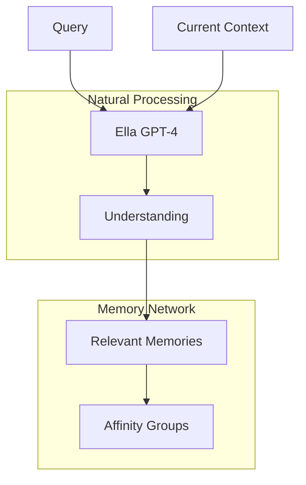

# Query Engine

## Overview

The Query Engine uses GPT-4's natural language understanding to find and connect relevant memories based on Ella's current context and personality. Instead of complex vector operations or graph traversals, it relies on Ella's ability to understand queries and find meaningful connections.

## Core Concepts

### Natural Query Flow


### Query Structure
```python
@dataclass
class Query:
    # Original query
    text: str
    
    # Ella's understanding
    intent: Dict[str, any]
    context: Dict[str, any]
    
    # Search parameters
    relevance_threshold: float = 0.7
    max_results: int = 10

@dataclass
class QueryResult:
    # Found memories
    memories: List[Memory]
    
    # Natural groupings
    affinity_groups: List[Dict[str, any]]
    
    # Ella's explanation
    reasoning: str
```

## Implementation

### 1. Query Processing
```python
class QueryEngine:
    async def process_query(self, query: str) -> QueryResult:
        # Let Ella understand the query
        understanding = await self.ella.understand_query(
            query=query,
            context=await self.get_current_context()
        )
        
        # Find relevant memories
        memories = await self.find_relevant_memories(
            understanding
        )
        
        # Group by natural affinity
        groups = await self.group_by_affinity(memories)
        
        # Get Ella's explanation
        reasoning = await self.ella.explain_results(
            query=query,
            memories=memories,
            groups=groups
        )
        
        return QueryResult(
            memories=memories,
            affinity_groups=groups,
            reasoning=reasoning
        )

    async def find_relevant_memories(
        self,
        understanding: Dict
    ) -> List[Memory]:
        # Get memories through natural understanding
        memories = await self.db.search(
            understanding=understanding,
            context=self.context
        )
        
        # Let Ella sort by relevance
        return await self.ella.sort_by_relevance(
            memories,
            understanding
        )
```

### 2. Affinity Grouping
```python
class QueryEngine:
    async def group_by_affinity(
        self,
        memories: List[Memory]
    ) -> List[Dict]:
        # Let Ella find natural groupings
        groups = await self.ella.find_memory_groups(
            memories
        )
        
        # Create affinity links
        for group in groups:
            await self.create_group_links(
                memories=group.memories,
                affinity=group.affinity_type,
                strength=group.strength
            )
        
        return groups
```

### 3. Context Integration
```python
class QueryEngine:
    async def get_current_context(self) -> Dict:
        # Get conversation context
        conversation = await self.get_recent_messages()
        
        # Get active memories
        memories = await self.get_active_memories()
        
        # Let Ella understand current state
        return await self.ella.understand_context(
            conversation,
            memories
        )
```

## Storage

### Database Schema
```sql
-- Memory search index
CREATE TABLE memory_search (
    memory_id UUID REFERENCES memories(id),
    context JSONB,
    understanding JSONB,
    PRIMARY KEY (memory_id)
);

-- Affinity groups
CREATE TABLE memory_groups (
    group_id UUID PRIMARY KEY,
    affinity_type TEXT NOT NULL,
    strength FLOAT NOT NULL,
    memories UUID[] NOT NULL
);

-- Efficient search
CREATE INDEX ON memory_search USING GIN (context);
CREATE INDEX ON memory_search USING GIN (understanding);
```

## Example Usage

### Basic Query
```python
# Search for memories
result = await query_engine.process_query(
    "What makes me happy?"
)

# View results with Ella's explanation
print(result.reasoning)
# "I found memories related to joy and personal wellbeing.
#  They naturally group into outdoor experiences and social
#  interactions."

# View memories by group
for group in result.affinity_groups:
    print(f"\n{group.name}:")
    for memory in group.memories:
        print(f"- {memory.content}")
# Outdoor Joy:
# - "I love how the sunset looks today!"
# - "Had a great time at the beach"
# 
# Social Connection:
# - "Great dinner with friends"
# - "Fun game night at home"
```

### Context-Aware Search
```python
# Update context first
await context_engine.update_context(
    "I'm feeling creative today"
)

# Search with current context
result = await query_engine.process_query(
    "What inspires me?"
)

# View naturally grouped results
for memory in result.memories:
    print(f"{memory.content} ({memory.affinity})")
# "The sunset's colors were amazing" (visual inspiration)
# "Writing poetry in the garden" (creative flow)
# "That modern art exhibition" (artistic influence)
```

## Benefits

1. **Natural Understanding**: Uses GPT-4's comprehension for queries
2. **Context Awareness**: Every search considers current state
3. **Meaningful Groups**: Memories cluster by natural affinity
4. **Clear Explanations**: Ella explains why memories are relevant
5. **Simple Implementation**: No complex search algorithms
