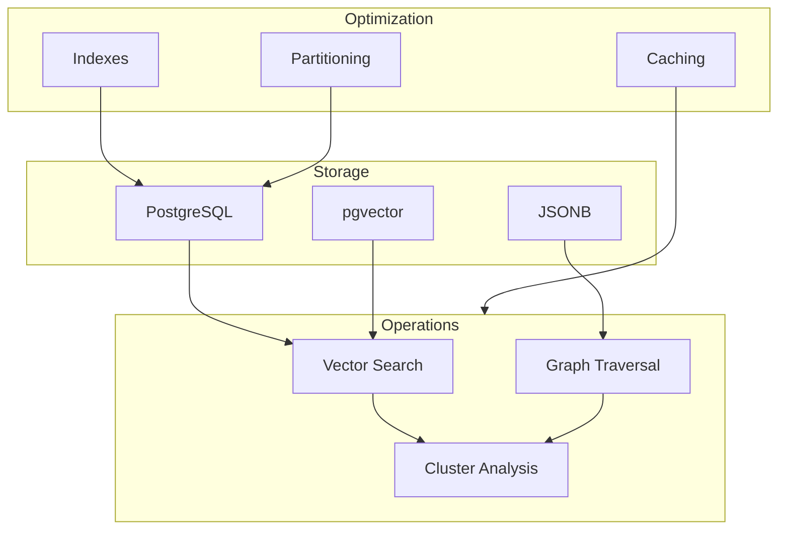

# Data Architecture

## Overview
EUMAS's data architecture is designed to efficiently store and retrieve memories while maintaining complex relationships and contextual information.

## Core Components

### Memory Storage
- [Schema Design](schema.md)
  - Database schema
  - Table relationships
  - Indexes and constraints

### Memory Relationships
- [Graph Structure](graph.md)
  - Graph representation
  - Relationship types
  - Traversal patterns

### Vector Operations
- [Vector Management](vectors.md)
  - Embedding storage
  - Similarity search
  - Clustering operations

## Key Features

### High-Performance Design


### Query Performance
- Optimized indexes for vector and graph operations
- Efficient memory retrieval patterns
- Scalable clustering mechanisms

### Data Integrity
- Foreign key constraints
- Transaction management
- Consistency checks

## Implementation Examples

### Memory Creation
```sql
-- Create memory with vector embedding
INSERT INTO memories (
    user_prompt,
    assistant_response,
    embedding,
    context
) VALUES (
    'How do I implement a binary tree?',
    'A binary tree can be implemented...',
    '[0.1, 0.2, ...]'::vector,
    '{"topic": "data_structures", "complexity": "medium"}'::jsonb
);
```

### Relationship Management
```sql
-- Create memory relationships
INSERT INTO memory_temporal_links (
    source_memory_id,
    target_memory_ids,
    relationship_type,
    cluster_strength
) VALUES (
    '123e4567-e89b-12d3-a456-426614174000',
    ARRAY['456e4567-e89b-12d3-a456-426614174000'],
    'semantic_cluster',
    ARRAY[0.85]
);
```

## Getting Started
1. [Schema Setup](schema.md#setup)
2. [Index Creation](schema.md#indexes)
3. [Vector Configuration](vectors.md#configuration)
4. [Graph Implementation](graph.md#implementation)

## Further Reading
- [Query Optimization](../optimization/README.md)
- [Performance Monitoring](../monitoring/README.md)
- [Backup Strategies](../maintenance/README.md)
