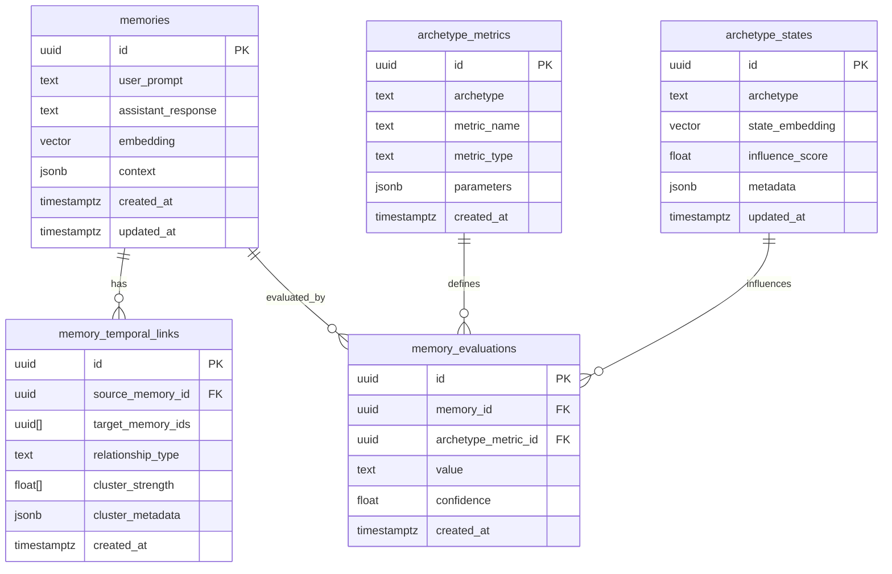

# Schema Design

## Database Schema

### Core Tables



## Table Definitions

### memories
```sql
CREATE TABLE memories (
    id UUID PRIMARY KEY DEFAULT uuid_generate_v4(),
    user_prompt TEXT NOT NULL,
    assistant_response TEXT NOT NULL,
    embedding vector(1536) NOT NULL,
    context JSONB NOT NULL DEFAULT '{}',
    created_at TIMESTAMPTZ DEFAULT CURRENT_TIMESTAMP,
    updated_at TIMESTAMPTZ DEFAULT CURRENT_TIMESTAMP,
    
    -- Ensure context is valid JSON
    CONSTRAINT valid_context CHECK (context IS NOT NULL)
);

-- Update timestamp trigger
CREATE TRIGGER update_memories_timestamp
    BEFORE UPDATE ON memories
    FOR EACH ROW
    EXECUTE FUNCTION update_timestamp();
```

### memory_temporal_links
```sql
CREATE TABLE memory_temporal_links (
    id UUID PRIMARY KEY DEFAULT uuid_generate_v4(),
    source_memory_id UUID REFERENCES memories(id),
    target_memory_ids UUID[] NOT NULL,
    relationship_type TEXT NOT NULL,
    cluster_strength FLOAT[] NOT NULL,
    cluster_metadata JSONB,
    created_at TIMESTAMPTZ DEFAULT CURRENT_TIMESTAMP,
    
    -- Ensure arrays match in length
    CONSTRAINT target_strength_match 
        CHECK (array_length(target_memory_ids, 1) = array_length(cluster_strength, 1))
);
```

### memory_evaluations
```sql
CREATE TABLE memory_evaluations (
    id UUID PRIMARY KEY DEFAULT uuid_generate_v4(),
    memory_id UUID REFERENCES memories(id),
    archetype_metric_id UUID REFERENCES archetype_metrics(id),
    value TEXT NOT NULL,
    confidence FLOAT NOT NULL CHECK (confidence >= 0 AND confidence <= 1),
    created_at TIMESTAMPTZ DEFAULT CURRENT_TIMESTAMP
);
```

### archetype_metrics
```sql
CREATE TABLE archetype_metrics (
    id UUID PRIMARY KEY DEFAULT uuid_generate_v4(),
    archetype TEXT NOT NULL,
    metric_name TEXT NOT NULL,
    metric_type TEXT NOT NULL,
    parameters JSONB NOT NULL DEFAULT '{}',
    created_at TIMESTAMPTZ DEFAULT CURRENT_TIMESTAMP,
    
    -- Ensure unique metric per archetype
    UNIQUE (archetype, metric_name)
);
```

### archetype_states
```sql
CREATE TABLE archetype_states (
    id UUID PRIMARY KEY DEFAULT uuid_generate_v4(),
    archetype TEXT UNIQUE NOT NULL,
    state_embedding vector(1536) NOT NULL,
    influence_score FLOAT NOT NULL DEFAULT 1.0,
    metadata JSONB NOT NULL DEFAULT '{}',
    updated_at TIMESTAMPTZ DEFAULT CURRENT_TIMESTAMP
);
```

## Indexes

### Vector Indexes
```sql
-- Create IVFFlat index for memory embeddings
CREATE INDEX memory_embedding_idx 
ON memories USING ivfflat (embedding vector_cosine_ops)
WITH (lists = 100);

-- Create IVFFlat index for archetype state embeddings
CREATE INDEX archetype_state_embedding_idx 
ON archetype_states USING ivfflat (state_embedding vector_cosine_ops)
WITH (lists = 50);
```

### Relationship Indexes
```sql
-- Index for source memory lookups
CREATE INDEX memory_temporal_source_idx 
ON memory_temporal_links (source_memory_id);

-- GIN index for target memory array searches
CREATE INDEX memory_temporal_targets_idx 
ON memory_temporal_links USING gin (target_memory_ids);

-- Index for relationship type queries
CREATE INDEX memory_temporal_type_idx 
ON memory_temporal_links (relationship_type);
```

### Evaluation Indexes
```sql
-- Composite index for memory evaluations
CREATE INDEX memory_evaluation_lookup_idx 
ON memory_evaluations (memory_id, archetype_metric_id);

-- Index for archetype metric lookups
CREATE INDEX archetype_metric_lookup_idx 
ON archetype_metrics (archetype, metric_name);
```

## Functions and Triggers

### Timestamp Management
```sql
CREATE OR REPLACE FUNCTION update_timestamp()
RETURNS TRIGGER AS $$
BEGIN
    NEW.updated_at = CURRENT_TIMESTAMP;
    RETURN NEW;
END;
$$ language 'plpgsql';
```

### Vector Operations
```sql
-- Function to find similar memories
CREATE OR REPLACE FUNCTION find_similar_memories(
    query_embedding vector(1536),
    similarity_threshold float,
    max_results integer
)
RETURNS TABLE (
    id uuid,
    similarity float
) AS $$
BEGIN
    RETURN QUERY
    SELECT 
        memories.id,
        1 - (memories.embedding <=> query_embedding) as similarity
    FROM memories
    WHERE 1 - (memories.embedding <=> query_embedding) > similarity_threshold
    ORDER BY similarity DESC
    LIMIT max_results;
END;
$$ LANGUAGE plpgsql;
```

## Sample Queries

### Memory Retrieval
```sql
-- Find memories with context matching
SELECT m.*, 1 - (m.embedding <=> :query_embedding) as similarity
FROM memories m
WHERE m.context @> '{"topic": "programming"}'
  AND 1 - (m.embedding <=> :query_embedding) > 0.8
ORDER BY similarity DESC
LIMIT 10;
```

### Graph Traversal
```sql
-- Find connected memories up to 2 hops
WITH RECURSIVE memory_graph AS (
    -- Base case
    SELECT 
        source_memory_id,
        target_memory_ids,
        cluster_strength,
        1 as depth
    FROM memory_temporal_links
    WHERE source_memory_id = :start_id

    UNION ALL

    -- Recursive case
    SELECT 
        l.source_memory_id,
        l.target_memory_ids,
        l.cluster_strength,
        g.depth + 1
    FROM memory_temporal_links l
    JOIN memory_graph g ON l.source_memory_id = ANY(g.target_memory_ids)
    WHERE g.depth < 2
)
SELECT DISTINCT *
FROM memory_graph;
```

### Archetype Analysis
```sql
-- Get memory evaluations by archetype
SELECT 
    m.user_prompt,
    m.assistant_response,
    me.value as evaluation,
    me.confidence,
    am.metric_name
FROM memories m
JOIN memory_evaluations me ON m.id = me.memory_id
JOIN archetype_metrics am ON me.archetype_metric_id = am.id
WHERE am.archetype = :archetype_name
  AND me.confidence > 0.8
ORDER BY me.created_at DESC;
```

## Data Types

### Custom Types
```sql
-- Vector type (provided by pgvector)
-- Used for storing embeddings
vector(1536)

-- JSONB
-- Used for flexible storage of:
-- - Context information
-- - Cluster metadata
-- - Archetype parameters
jsonb
```

### Enums and Constants
```sql
-- Relationship types
CREATE TYPE relationship_type AS ENUM (
    'semantic_cluster',
    'temporal_sequence',
    'causal_link',
    'contextual_association'
);

-- Metric types
CREATE TYPE metric_type AS ENUM (
    'numeric',
    'categorical',
    'boolean',
    'vector'
);
```

## Maintenance

### Vacuuming
```sql
-- Regular vacuum for performance
VACUUM ANALYZE memories;
VACUUM ANALYZE memory_temporal_links;
VACUUM ANALYZE memory_evaluations;
```

### Statistics
```sql
-- Update statistics for query planning
ANALYZE memories;
ANALYZE memory_temporal_links;
ANALYZE memory_evaluations;
```

### Monitoring
```sql
-- Monitor table sizes
SELECT 
    relname as table_name,
    pg_size_pretty(pg_total_relation_size(relid)) as total_size
FROM pg_catalog.pg_statio_user_tables
ORDER BY pg_total_relation_size(relid) DESC;
```
