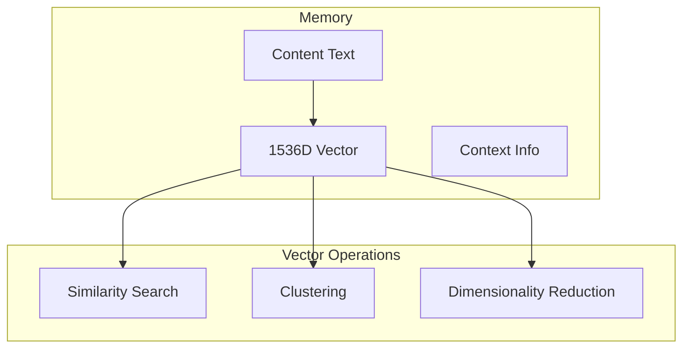

# Vector Operations

## Overview

EUMAS uses high-dimensional vectors (embeddings) to represent memories and their relationships. This document details the vector operations and optimizations used in the system.

## Vector Storage

### Embedding Structure


### Implementation

#### Vector Type
```sql
-- Enable pgvector extension
CREATE EXTENSION IF NOT EXISTS vector;

-- Create table with vector column
CREATE TABLE memories (
    id UUID PRIMARY KEY DEFAULT uuid_generate_v4(),
    content TEXT NOT NULL,
    embedding vector(1536) NOT NULL,
    context JSONB
);

-- Create IVFFlat index
CREATE INDEX ON memories 
USING ivfflat (embedding vector_cosine_ops)
WITH (lists = 100);
```

## Vector Operations

### Similarity Search
```python
def find_similar_memories(
    query_embedding: np.ndarray,
    threshold: float = 0.8,
    limit: int = 10
) -> List[Dict]:
    query = """
    SELECT 
        id,
        content,
        context,
        1 - (embedding <=> $1) as similarity
    FROM memories
    WHERE 1 - (embedding <=> $1) > $2
    ORDER BY similarity DESC
    LIMIT $3;
    """
    
    return execute_query(
        query,
        [query_embedding, threshold, limit]
    )
```

### Batch Processing
```python
async def process_embeddings_batch(
    texts: List[str]
) -> List[np.ndarray]:
    # Generate embeddings in parallel
    async with openai.AsyncClient() as client:
        responses = await asyncio.gather(*[
            client.embeddings.create(
                model="text-embedding-ada-002",
                input=text
            ) for text in texts
        ])
    
    return [r.data[0].embedding for r in responses]
```

## Clustering Operations

### K-Means Clustering
```python
def cluster_memories(
    embeddings: np.ndarray,
    n_clusters: int = 10
) -> Dict[int, List[UUID]]:
    # Perform clustering
    kmeans = KMeans(
        n_clusters=n_clusters,
        random_state=42
    ).fit(embeddings)
    
    # Group memories by cluster
    clusters = defaultdict(list)
    for idx, label in enumerate(kmeans.labels_):
        clusters[label].append(memory_ids[idx])
    
    return clusters
```

### HDBSCAN Implementation
```python
def density_based_clustering(
    embeddings: np.ndarray,
    min_cluster_size: int = 5
) -> Dict[int, List[UUID]]:
    # Initialize clusterer
    clusterer = hdbscan.HDBSCAN(
        min_cluster_size=min_cluster_size,
        metric='euclidean'
    )
    
    # Perform clustering
    cluster_labels = clusterer.fit_predict(embeddings)
    
    # Group by cluster
    clusters = defaultdict(list)
    for idx, label in enumerate(cluster_labels):
        if label >= 0:  # Ignore noise points
            clusters[label].append(memory_ids[idx])
    
    return clusters
```

## Dimensionality Reduction

### UMAP Visualization
```python
def reduce_dimensions(
    embeddings: np.ndarray,
    n_components: int = 2
) -> np.ndarray:
    reducer = umap.UMAP(
        n_components=n_components,
        metric='cosine',
        random_state=42
    )
    
    return reducer.fit_transform(embeddings)
```

### PCA Implementation
```python
def pca_reduction(
    embeddings: np.ndarray,
    n_components: int = 50
) -> np.ndarray:
    pca = PCA(n_components=n_components)
    reduced = pca.fit_transform(embeddings)
    
    # Calculate explained variance
    explained_variance = np.sum(pca.explained_variance_ratio_)
    logger.info(f"Explained variance: {explained_variance:.2%}")
    
    return reduced
```

## Optimization Techniques

### Approximate Nearest Neighbors
```python
def build_ann_index(
    embeddings: np.ndarray,
    n_trees: int = 10
) -> annoy.AnnoyIndex:
    # Initialize index
    index = annoy.AnnoyIndex(embeddings.shape[1], 'angular')
    
    # Add items
    for i, embedding in enumerate(embeddings):
        index.add_item(i, embedding)
    
    # Build index
    index.build(n_trees)
    return index
```

### Vector Quantization
```python
def quantize_embeddings(
    embeddings: np.ndarray,
    n_centroids: int = 256
) -> Tuple[np.ndarray, np.ndarray]:
    # Train quantizer
    quantizer = faiss.IndexFlatL2(embeddings.shape[1])
    index = faiss.IndexIVFFlat(
        quantizer,
        embeddings.shape[1],
        n_centroids
    )
    
    # Train and encode
    index.train(embeddings)
    codes = np.zeros((len(embeddings), 2), dtype=np.int64)
    index.encode_multiple(embeddings, codes)
    
    return codes
```

## Performance Monitoring

### Vector Operation Metrics
```python
@dataclass
class VectorMetrics:
    operation_type: str
    duration_ms: float
    vector_count: int
    dimension: int
    
    def log_metrics(self):
        logger.info(
            f"Vector operation: {self.operation_type}\n"
            f"Duration: {self.duration_ms:.2f}ms\n"
            f"Vectors: {self.vector_count}\n"
            f"Dimension: {self.dimension}"
        )

def measure_vector_operation(
    func: Callable
) -> Callable:
    @wraps(func)
    async def wrapper(*args, **kwargs):
        start = time.perf_counter()
        result = await func(*args, **kwargs)
        duration = (time.perf_counter() - start) * 1000
        
        metrics = VectorMetrics(
            operation_type=func.__name__,
            duration_ms=duration,
            vector_count=len(result),
            dimension=len(result[0])
        )
        metrics.log_metrics()
        
        return result
    return wrapper
```

## Caching Strategy

### Embedding Cache
```python
class EmbeddingCache:
    def __init__(self, capacity: int = 10000):
        self.cache = LRUCache(capacity)
        self.lock = asyncio.Lock()
    
    async def get_embedding(
        self,
        text: str,
        force_refresh: bool = False
    ) -> np.ndarray:
        cache_key = hash(text)
        
        async with self.lock:
            if not force_refresh and cache_key in self.cache:
                return self.cache[cache_key]
            
            embedding = await generate_embedding(text)
            self.cache[cache_key] = embedding
            return embedding
```

### Batch Cache
```python
class BatchEmbeddingCache:
    def __init__(self, batch_size: int = 32):
        self.batch_size = batch_size
        self.pending = []
        self.lock = asyncio.Lock()
    
    async def add_to_batch(
        self,
        text: str
    ) -> asyncio.Future:
        future = asyncio.Future()
        
        async with self.lock:
            self.pending.append((text, future))
            
            if len(self.pending) >= self.batch_size:
                await self.process_batch()
        
        return await future
    
    async def process_batch(self):
        texts, futures = zip(*self.pending)
        embeddings = await process_embeddings_batch(texts)
        
        for future, embedding in zip(futures, embeddings):
            future.set_result(embedding)
        
        self.pending.clear()
```
