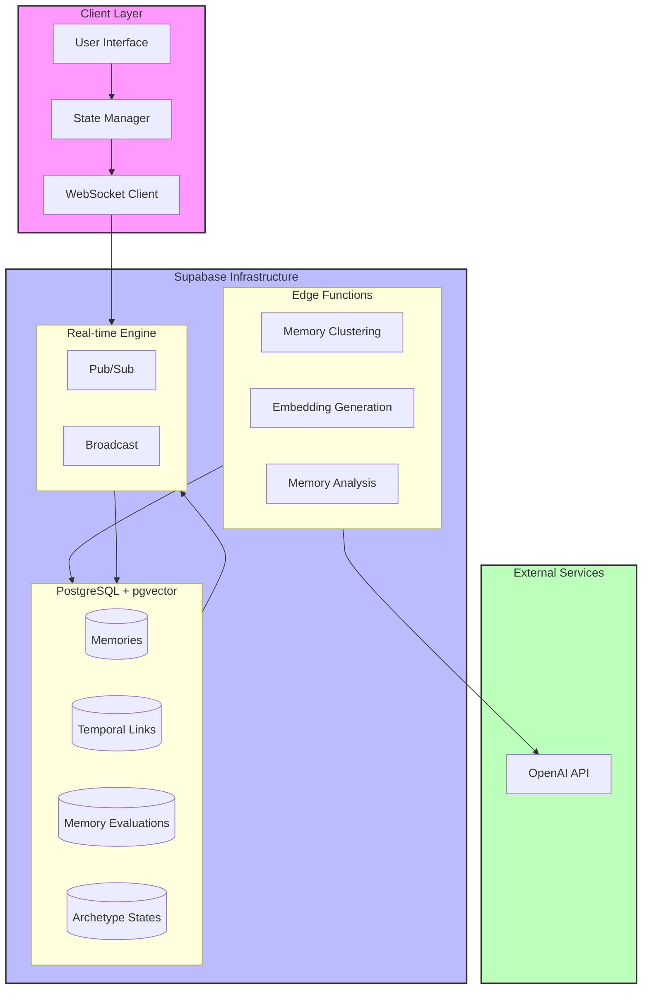
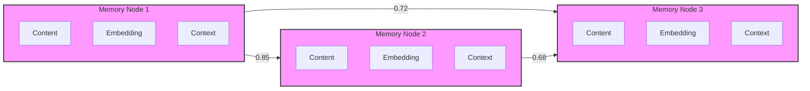
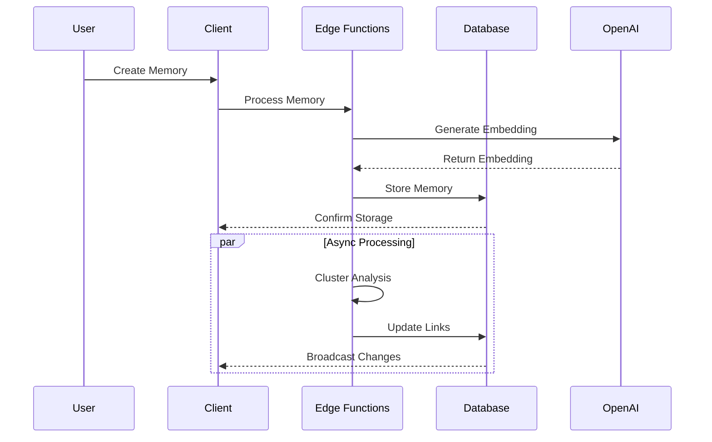
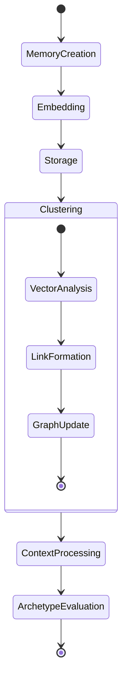
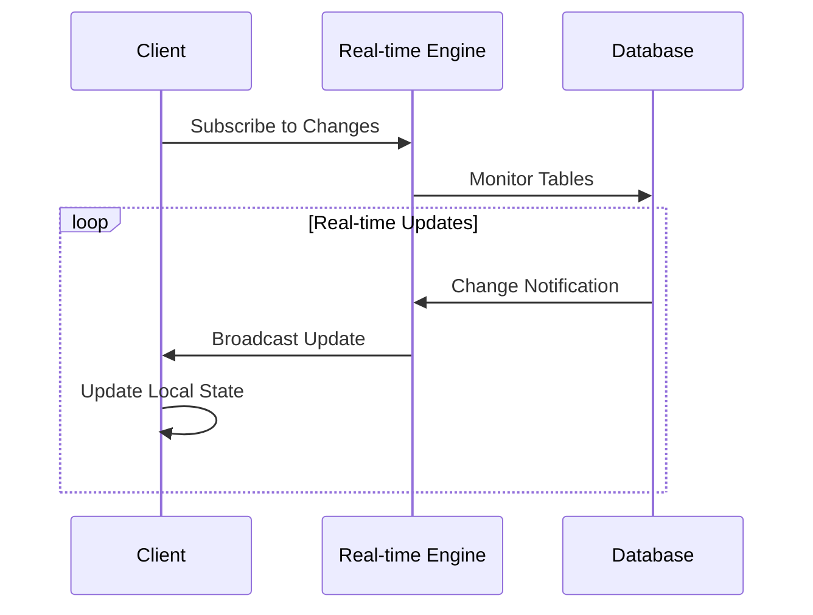

# System Architecture

## High-Level Architecture

```mermaid
graph TB
    subgraph Client["Client Layer"]
        UI[User Interface]
        StateManager[State Manager]
        WebSocket[WebSocket Client]
    end

    subgraph Supabase["Supabase Infrastructure"]
        subgraph EdgeFunctions["Edge Functions"]
            Clustering[Memory Clustering]
            Embedding[Embedding Generation]
            Analysis[Memory Analysis]
        end

        subgraph Database["PostgreSQL + pgvector"]
            Memories[(Memories)]
            Links[(Temporal Links)]
            Evaluations[(Memory Evaluations)]
            States[(Archetype States)]
        end

        subgraph RealTime["Real-time Engine"]
            PubSub[Pub/Sub]
            Broadcast[Broadcast]
        end
    end

    subgraph External["External Services"]
        OpenAI[OpenAI API]
    end

    UI --> StateManager
    StateManager --> WebSocket
    WebSocket --> RealTime
    
    EdgeFunctions --> Database
    EdgeFunctions --> OpenAI
    
    RealTime --> Database
    Database --> RealTime

    style Client fill:#f9f,stroke:#333,stroke-width:2px
    style Supabase fill:#bbf,stroke:#333,stroke-width:2px
    style External fill:#bfb,stroke:#333,stroke-width:2px
```

## Memory Graph Structure

```mermaid
graph LR
    subgraph Memory1[Memory Node 1]
        Content1[Content]
        Embedding1[Embedding]
        Context1[Context]
    end

    subgraph Memory2[Memory Node 2]
        Content2[Content]
        Embedding2[Embedding]
        Context2[Context]
    end

    subgraph Memory3[Memory Node 3]
        Content3[Content]
        Embedding3[Embedding]
        Context3[Context]
    end

    Memory1 -->|0.85| Memory2
    Memory1 -->|0.72| Memory3
    Memory2 -->|0.68| Memory3

    style Memory1 fill:#f9f,stroke:#333,stroke-width:2px
    style Memory2 fill:#f9f,stroke:#333,stroke-width:2px
    style Memory3 fill:#f9f,stroke:#333,stroke-width:2px
```

## Data Flow

```mermaid
sequenceDiagram
    participant U as User
    participant C as Client
    participant E as Edge Functions
    participant D as Database
    participant O as OpenAI

    U->>C: Create Memory
    C->>E: Process Memory
    E->>O: Generate Embedding
    O-->>E: Return Embedding
    E->>D: Store Memory
    D-->>C: Confirm Storage
    
    par Async Processing
        E->>E: Cluster Analysis
        E->>D: Update Links
        D-->>C: Broadcast Changes
    end
```

## Component Interaction

```mermaid
stateDiagram-v2
    [*] --> MemoryCreation
    MemoryCreation --> Embedding
    Embedding --> Storage
    Storage --> Clustering
    
    state Clustering {
        [*] --> VectorAnalysis
        VectorAnalysis --> LinkFormation
        LinkFormation --> GraphUpdate
        GraphUpdate --> [*]
    }
    
    Clustering --> ContextProcessing
    ContextProcessing --> ArchetypeEvaluation
    ArchetypeEvaluation --> [*]
```

## Real-time Updates

```mermaid
sequenceDiagram
    participant C as Client
    participant R as Real-time Engine
    participant D as Database
    
    C->>R: Subscribe to Changes
    R->>D: Monitor Tables
    
    loop Real-time Updates
        D->>R: Change Notification
        R->>C: Broadcast Update
        C->>C: Update Local State
    end
```
