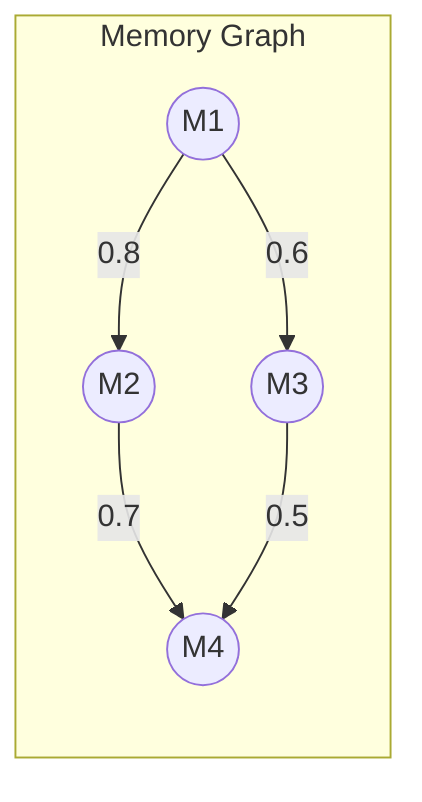
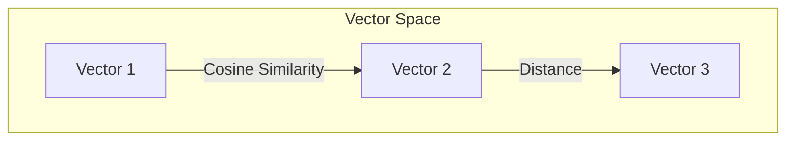

# Computer Science Concepts

## Graph Theory

### Memory Graph Structure
EUMAS represents memories and their relationships as a weighted, directed graph.



### Graph Algorithms

#### Depth-First Traversal
```python
def traverse_memory_graph(start_memory: UUID, max_depth: int = 3):
    def dfs(memory_id: UUID, depth: int, visited: Set[UUID]):
        if depth > max_depth or memory_id in visited:
            return []
        
        visited.add(memory_id)
        related_memories = get_related_memories(memory_id)
        
        results = [memory_id]
        for related_id, strength in related_memories:
            if strength > THRESHOLD:
                results.extend(dfs(related_id, depth + 1, visited))
        
        return results
    
    return dfs(start_memory, 0, set())
```

#### PageRank for Memory Importance
```python
def calculate_memory_importance():
    query = """
    WITH RECURSIVE memory_graph AS (
        -- Initialize PageRank
        SELECT id, 1.0::float as rank
        FROM memories
        
        UNION ALL
        
        -- Iterate
        SELECT 
            m.id,
            0.15 + 0.85 * sum(g.rank * l.strength)
        FROM memories m
        JOIN memory_temporal_links l ON m.id = l.target_memory_id
        JOIN memory_graph g ON l.source_memory_id = g.id
        GROUP BY m.id
    )
    SELECT * FROM memory_graph;
    """
    return execute_query(query)
```

## Vector Operations

### Embedding Space


### Similarity Calculations
```python
def calculate_similarity(vec1: np.ndarray, vec2: np.ndarray):
    # Cosine similarity
    return np.dot(vec1, vec2) / (np.linalg.norm(vec1) * np.linalg.norm(vec2))

def find_similar_memories(query_vec: np.ndarray, threshold: float = 0.8):
    query = """
    SELECT id, content, 1 - (embedding <=> $1) as similarity
    FROM memories
    WHERE 1 - (embedding <=> $1) > $2
    ORDER BY similarity DESC;
    """
    return execute_query(query, [query_vec, threshold])
```

## Clustering Algorithms

### Affinity Propagation
Used for memory cluster formation:

```python
from sklearn.cluster import AffinityPropagation

def cluster_memories(memory_vectors: np.ndarray):
    # Calculate similarity matrix
    S = -euclidean_distances(memory_vectors, squared=True)
    
    # Perform clustering
    clustering = AffinityPropagation(
        damping=0.9,
        preference=-50
    ).fit(memory_vectors)
    
    return clustering.labels_
```

### HDBSCAN
Alternative clustering for density-based memory groups:

```python
import hdbscan

def density_based_clustering(memory_vectors: np.ndarray):
    clusterer = hdbscan.HDBSCAN(
        min_cluster_size=5,
        min_samples=3,
        metric='euclidean'
    )
    
    cluster_labels = clusterer.fit_predict(memory_vectors)
    return cluster_labels
```

## Information Retrieval

### TF-IDF for Context Weighting
```python
from sklearn.feature_extraction.text import TfidfVectorizer

def weight_context_terms(contexts: List[str]):
    vectorizer = TfidfVectorizer()
    tfidf_matrix = vectorizer.fit_transform(contexts)
    return tfidf_matrix
```

### BM25 Scoring
```python
def calculate_bm25_score(query: str, memory: dict):
    k1 = 1.5
    b = 0.75
    
    # Calculate term frequencies
    tf = calculate_term_frequency(query, memory['content'])
    
    # Document length normalization
    doc_len = len(memory['content'].split())
    avg_doc_len = get_average_memory_length()
    
    # BM25 score calculation
    score = sum([
        idf * ((tf * (k1 + 1)) / 
        (tf + k1 * (1 - b + b * doc_len / avg_doc_len)))
        for tf, idf in zip(tf, get_idf_values(query))
    ])
    
    return score
```

## Caching Strategies

### LRU Cache Implementation
```python
from functools import lru_cache

@lru_cache(maxsize=1000)
def get_memory_with_context(memory_id: UUID):
    memory = fetch_memory(memory_id)
    context = fetch_context(memory_id)
    return {**memory, 'context': context}
```

### Cache Invalidation
```python
def invalidate_memory_cache(memory_id: UUID):
    # Clear specific memory cache
    get_memory_with_context.cache_clear()
    
    # Update cache timestamp
    update_cache_timestamp(memory_id)
```

## Performance Optimization

### Batch Processing
```python
def process_memory_batch(memories: List[dict]):
    # Generate embeddings in batch
    texts = [m['content'] for m in memories]
    embeddings = generate_embeddings_batch(texts)
    
    # Bulk insert
    with get_db_connection() as conn:
        with conn.cursor() as cur:
            execute_values(
                cur,
                """
                INSERT INTO memories (content, embedding)
                VALUES %s
                """,
                [(m['content'], e) for m, e in zip(memories, embeddings)]
            )
```

### Index Optimization
```sql
-- Create GiST index for vector similarity
CREATE INDEX memory_embedding_idx ON memories 
USING ivfflat (embedding vector_cosine_ops)
WITH (lists = 100);

-- Create index for temporal queries
CREATE INDEX memory_temporal_idx ON memories 
USING BRIN (created_at);
```
