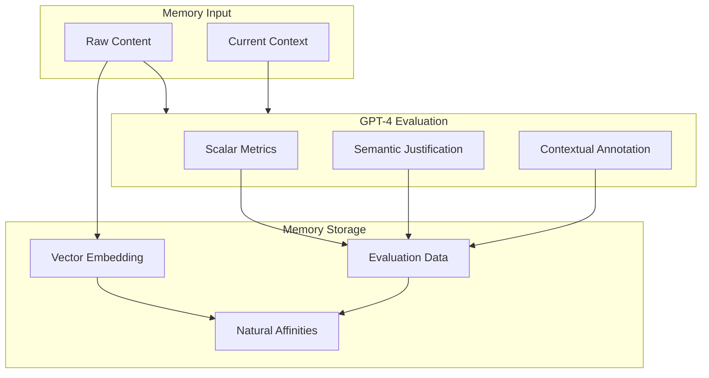
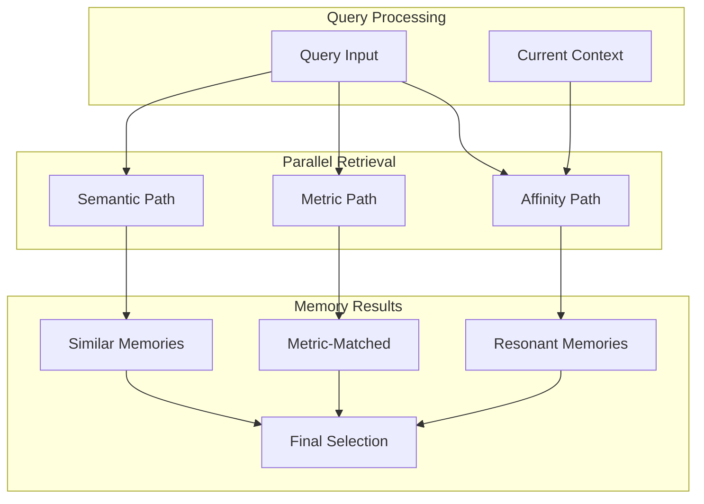

# Memory Models in EUMAS

## Overview
EUMAS uses a natural, GPT-4 driven approach to memory formation and retrieval, enhanced with quantifiable metrics for consistent personality development. Each memory evaluation includes scalar values, semantic justifications, and annotations across multiple dimensions.

## Memory Formation



## Memory Evaluation Structure

```typescript
interface MemoryEvaluation {
    // Archetype-specific metrics (0.0 to 1.0)
    metrics: {
        emotionalDepth: number;      // Emotional resonance
        empathyLevel: number;        // Compassionate response
        emotionalClarity: number;    // Clear expression
        internalEmotionalState: number; // Self-awareness
        // ... other archetype metrics
    };
    
    // Semantic justifications
    justifications: {
        emotionalDepth: string;      // Why this emotional depth?
        empathyLevel: string;        // Why this empathy level?
        emotionalClarity: string;    // Why this clarity level?
        internalEmotionalState: string; // Why this state?
        // ... other justifications
    };
    
    // Contextual annotations
    annotations: {
        spokenThoughts: string;      // Natural language reflection
        contextualNotes: string;     // Relevant background
        temporalMarkers: string;     // Time-based connections
    };
}
```

## Memory Retrieval



## Implementation Example

```python
class Memory:
    def __init__(self, content: str, context: dict):
        self.content = content
        self.context = context
        self.embedding = None
        self.evaluation = None
        self.affinities = None

    async def evaluate(self, gpt4_client):
        """Evaluate memory through GPT-4's understanding with metrics"""
        response = await gpt4_client.chat.completions.create(
            model="gpt-4",
            messages=[
                {
                    "role": "system",
                    "content": "You are Ella, evaluating a new memory. For each metric, provide:\n1. A scalar value (0.0-1.0)\n2. A semantic justification\n3. A contextual annotation"
                },
                {
                    "role": "user",
                    "content": f"Memory: {self.content}\nContext: {self.context}"
                }
            ]
        )
        self.evaluation = parse_metric_evaluation(response.choices[0].message.content)
        
    async def discover_affinities(self, affinity_client):
        """Discover natural memory connections using metrics"""
        affinities = await affinity_client.invoke(
            'affinity-discovery',
            {
                'content': self.content,
                'evaluation': self.evaluation,
                'metrics': self.evaluation.metrics  # Include metric values
            }
        )
        self.affinities = affinities.data
```

## Key Concepts

### Metric-Based Evaluation
- Each memory aspect has a scalar value (0.0-1.0)
- Values come with semantic justifications
- Contextual annotations provide natural language understanding

### Multi-Path Retrieval
- Semantic: Vector similarity search
- Metric: Match based on evaluation metrics
- Affinity: Natural connections through GPT-4

### Natural Growth
- Metrics enable consistent personality development
- Annotations maintain contextual awareness
- Values provide quantifiable growth over time

For implementation details, see:
- [Memory System](../components/memory.md)
- [Query Engine](../components/query.md)
- [Supabase Integration](../engineering/supabase.md)
