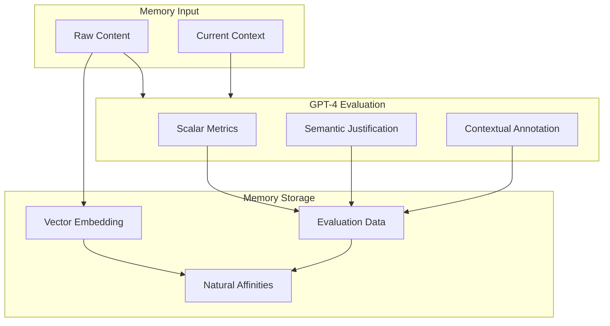
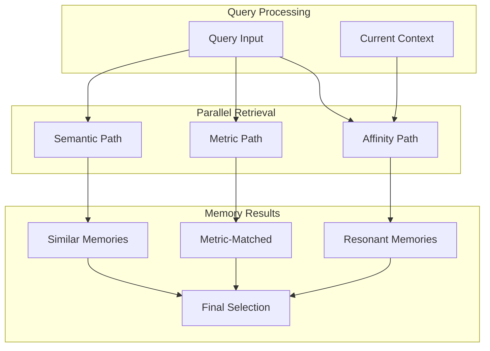

# Memory Models in EUMAS

## Overview
EUMAS uses a natural, GPT-4 driven approach to memory formation and retrieval, enhanced with quantifiable metrics for consistent personality development. Each memory evaluation includes scalar values, semantic justifications, and annotations across multiple dimensions.

## Memory Formation



## Memory Evaluation Structure

### Prompt Structure
```typescript
interface MemoryPrompt {
    // Raw content
    content: string;
    
    // Current context
    context: {
        user_state: string;
        conversation_history: string[];
        relevant_memories: Memory[];
        current_goals: string[];
    };
    
    // Evaluation requirements
    requirements: {
        metrics_required: boolean;
        annotations_required: boolean;
        priority_required: boolean;
    };
    
    // Archetype configuration
    archetype: {
        name: string;
        personality: string;
        evaluation_focus: string[];
        metric_definitions: Record<string, string>;
    };
}
```

### Response Structure
```typescript
interface MemoryEvaluation {
    // Archetype-specific metrics (0.0 to 1.0)
    metrics: {
        emotionalDepth: number;      // Emotional resonance
        empathyLevel: number;        // Compassionate response
        emotionalClarity: number;    // Clear expression
        internalEmotionalState: number; // Self-awareness
        
        // Ontological metrics
        ontologicalInsight: number;  // Existential understanding
        philosophicalDepth: number;  // Abstract reasoning
        selfCoherence: number;       // Identity consistency
        preservationInstinct: number; // Self-preservation
        
        // Experience metrics
        noveltyFactor: number;       // Experience uniqueness
        growthPotential: number;     // Development opportunity
        curiosityTrigger: number;    // Intellectual interest
        explorationValue: number;    // Investigation worth
        
        // ... other archetype metrics
    };
    
    // Semantic justifications
    justifications: {
        metric_justifications: Record<string, string>;
        priority_justification: string;
        affinity_justification: string;
    };
    
    // Contextual annotations
    annotations: {
        spoken_annotation: string;    // Natural language reflection
        context_notes: string;       // Background and context
        relationship_impact: string;  // Effect on relationships
        identity_notes: string;      // Impact on self-understanding
        learning_notes: string;      // Key insights
        future_directions: string;   // Areas to explore
    };
    
    // Priority and relationships
    priority: {
        score: number;              // 0.0 to 1.0 priority score
        factors: string[];          // Factors affecting priority
        decay_rate: number;         // Time decay factor
    };
    
    // Memory affinities
    affinities: {
        semantic_similarity: number[]; // Vector similarities
        metric_similarity: number[];   // Metric-based similarities
        relationship_strength: number; // Overall connection strength
        related_memories: string[];    // Related memory IDs
    };
}
```

## Memory Formation Process

1. **Input Processing**
```typescript
interface MemoryInput {
    content: string;               // Raw interaction content
    context: Context;             // Current context state
    metadata: Metadata;           // Basic metadata
}
```

2. **Archetype Evaluation**
```typescript
interface ArchetypeEvaluation {
    archetype: string;            // Evaluating archetype
    evaluation: MemoryEvaluation; // Full evaluation data
    priority: number;             // Archetype priority score
}
```

3. **Memory Integration**
```typescript
interface IntegratedMemory {
    input: MemoryInput;           // Original input
    evaluations: ArchetypeEvaluation[]; // All archetype evaluations
    aggregate_metrics: Record<string, number>; // Combined metrics
    aggregate_priority: number;   // Overall priority score
    relationships: string[];      // Related memory IDs
}
```

4. **Storage Format**
```typescript
interface StoredMemory {
    id: string;                   // Unique memory ID
    content: string;              // Original content
    embedding: number[];          // Vector embedding
    evaluations: Record<string, MemoryEvaluation>; // Archetype evaluations
    metadata: Metadata;           // Extended metadata
    relationships: Relationships; // Memory relationships
}
```

## Memory Retrieval



## Implementation Example

```python
class Memory:
    def __init__(self, content: str, context: dict):
        self.content = content
        self.context = context
        self.embedding = None
        self.evaluation = None
        self.affinities = None

    async def evaluate(self, gpt4_client):
        """Evaluate memory through GPT-4's understanding with metrics"""
        response = await gpt4_client.chat.completions.create(
            model="gpt-4",
            messages=[
                {
                    "role": "system",
                    "content": "You are Ella, evaluating a new memory. For each metric, provide:\n1. A scalar value (0.0-1.0)\n2. A semantic justification\n3. A contextual annotation"
                },
                {
                    "role": "user",
                    "content": f"Memory: {self.content}\nContext: {self.context}"
                }
            ]
        )
        self.evaluation = parse_metric_evaluation(response.choices[0].message.content)
        
    async def discover_affinities(self, affinity_client):
        """Discover natural memory connections using metrics"""
        affinities = await affinity_client.invoke(
            'affinity-discovery',
            {
                'content': self.content,
                'evaluation': self.evaluation,
                'metrics': self.evaluation.metrics  # Include metric values
            }
        )
        self.affinities = affinities.data

async def process_memory(content: str, context: Context) -> StoredMemory:
    # Create memory input
    memory_input = MemoryInput(
        content=content,
        context=context,
        metadata=extract_metadata(content)
    )
    
    # Collect archetype evaluations
    evaluations = []
    for archetype in ARCHETYPES:
        prompt = create_evaluation_prompt(memory_input, archetype)
        evaluation = await evaluate_with_archetype(prompt)
        evaluations.append(ArchetypeEvaluation(
            archetype=archetype.name,
            evaluation=evaluation,
            priority=calculate_priority(evaluation)
        ))
    
    # Integrate evaluations
    integrated = integrate_memory(memory_input, evaluations)
    
    # Store memory
    stored = await store_memory(integrated)
    
    return stored
```

## Key Concepts

### Metric-Based Evaluation
- Each memory aspect has a scalar value (0.0-1.0)
- Values come with semantic justifications
- Contextual annotations provide natural language understanding

### Multi-Path Retrieval
- Semantic: Vector similarity search
- Metric: Match based on evaluation metrics
- Affinity: Natural connections through GPT-4

### Natural Growth
- Metrics enable consistent personality development
- Annotations maintain contextual awareness
- Values provide quantifiable growth over time

For implementation details, see:
- [Memory System](../components/memory.md)
- [Query Engine](../components/query.md)
- [Supabase Integration](../engineering/supabase.md)
