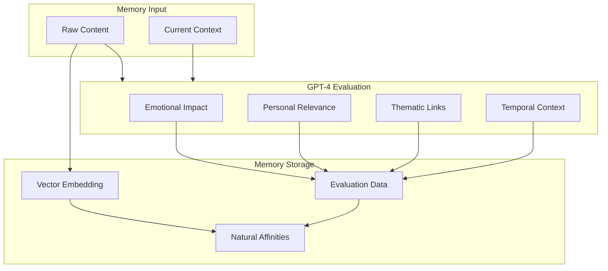
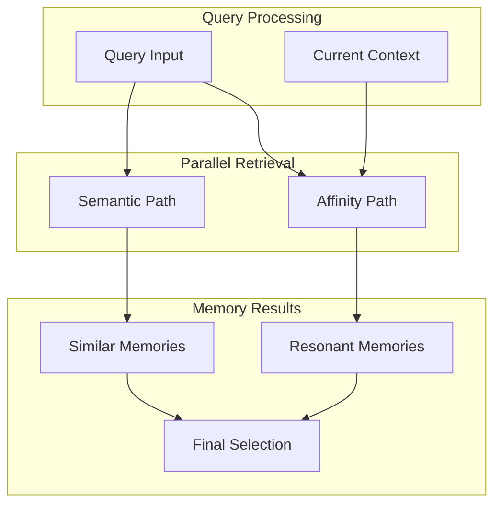

# Memory Models in EUMAS

## Overview
EUMAS uses a natural, GPT-4 driven approach to memory formation and retrieval. Instead of implementing traditional cognitive architectures, we leverage GPT-4's deep understanding to create a more fluid and natural memory system.

## Memory Formation



## Memory Retrieval



## Implementation Example

```python
class Memory:
    def __init__(self, content: str, context: dict):
        self.content = content
        self.context = context
        self.embedding = None
        self.evaluation = None
        self.affinities = None

    async def evaluate(self, gpt4_client):
        """Evaluate memory through GPT-4's understanding"""
        response = await gpt4_client.chat.completions.create(
            model="gpt-4",
            messages=[
                {
                    "role": "system",
                    "content": "You are Ella, evaluating a new memory. Consider its emotional impact, personal relevance, and thematic connections."
                },
                {
                    "role": "user",
                    "content": f"Memory: {self.content}\nContext: {self.context}"
                }
            ]
        )
        self.evaluation = response.choices[0].message.content
        
    async def discover_affinities(self, affinity_client):
        """Discover natural memory connections"""
        affinities = await affinity_client.invoke(
            'affinity-discovery',
            {
                'content': self.content,
                'evaluation': self.evaluation
            }
        )
        self.affinities = affinities.data
```

## Key Concepts

### Natural Evaluation
- GPT-4 evaluates each memory across multiple dimensions
- Emotional significance is captured naturally
- Personal relevance is understood contextually
- Thematic connections emerge organically

### Affinity Discovery
- Natural clustering through GPT-4's understanding
- Memories connect based on:
  - Emotional resonance
  - Thematic similarity
  - Personal significance
  - Temporal relationships
  - Causal connections

### Context Flow
- Dynamic state management through GPT-4
- Natural transitions between contexts
- Organic memory activation based on relevance

For implementation details, see:
- [Memory System](../components/memory.md)
- [Query Engine](../components/query.md)
- [Supabase Integration](../engineering/supabase.md)
