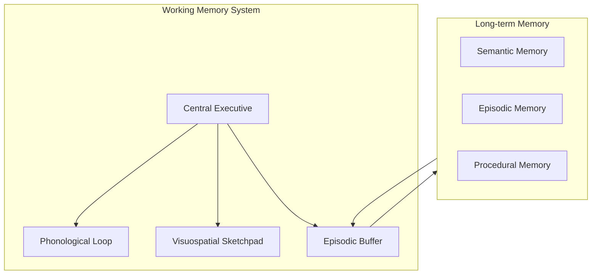
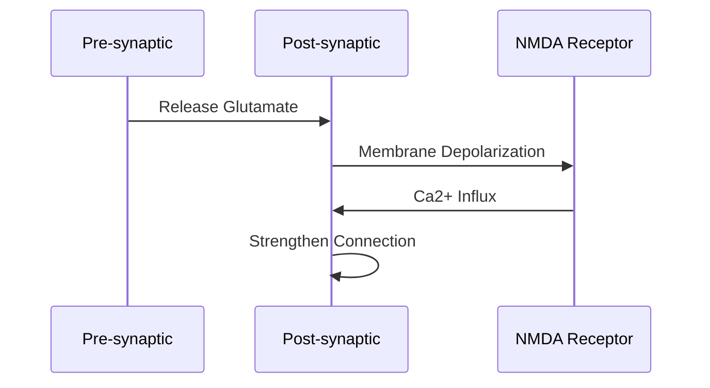
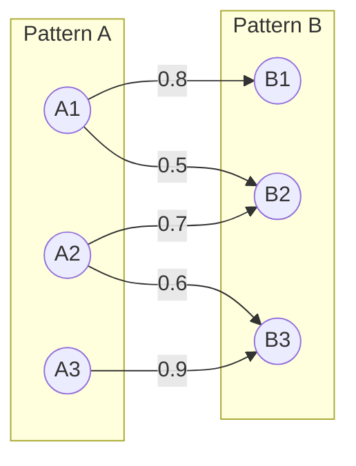
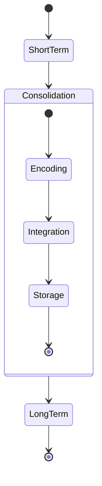

# Memory Models

## Cognitive Architecture

### Working Memory Model


### EUMAS Implementation
```python
class WorkingMemorySystem:
    def __init__(self):
        self.central_executive = CentralExecutive()
        self.phonological_loop = PhonologicalLoop()
        self.visuospatial_sketchpad = VisuospatialSketchpad()
        self.episodic_buffer = EpisodicBuffer()
    
    def process_input(self, input_data: dict):
        # Route input to appropriate subsystem
        if input_data['type'] == 'verbal':
            self.phonological_loop.process(input_data)
        elif input_data['type'] == 'visual':
            self.visuospatial_sketchpad.process(input_data)
        
        # Integrate in episodic buffer
        integrated_memory = self.episodic_buffer.integrate(
            self.phonological_loop.get_state(),
            self.visuospatial_sketchpad.get_state()
        )
        
        return integrated_memory
```

## Long-term Potentiation

### Synaptic Strengthening


### Memory Strength Model
```python
class MemoryStrength:
    def __init__(self):
        self.base_strength = 1.0
        self.decay_rate = 0.1
        self.reinforcement_factor = 1.2
    
    def calculate_current_strength(self, time_elapsed: float):
        return self.base_strength * math.exp(-self.decay_rate * time_elapsed)
    
    def reinforce(self):
        self.base_strength *= self.reinforcement_factor
```

## Associative Memory Networks

### Hebbian Learning Implementation
```python
def update_connection_strength(
    pre_memory: UUID,
    post_memory: UUID,
    activation: float
):
    query = """
    UPDATE memory_temporal_links
    SET strength = LEAST(
        strength + $3 * learning_rate,
        max_strength
    )
    WHERE source_memory_id = $1
      AND target_memory_id = $2
    """
    execute_query(query, [pre_memory, post_memory, activation])
```

### Pattern Association


## Memory Consolidation Process

### Systems Consolidation


### Implementation
```python
class MemoryConsolidation:
    def __init__(self):
        self.short_term_buffer = []
        self.consolidation_threshold = 0.7
    
    async def consolidate_memories(self):
        while True:
            # Process short-term buffer
            for memory in self.short_term_buffer:
                if self.should_consolidate(memory):
                    await self.move_to_long_term(memory)
            
            # Sleep-like delay
            await asyncio.sleep(CONSOLIDATION_INTERVAL)
    
    def should_consolidate(self, memory: dict) -> bool:
        return (
            memory['activation'] > self.consolidation_threshold or
            memory['importance'] > self.consolidation_threshold
        )
```

## Retrieval Mechanisms

### Context-Based Retrieval
```python
def retrieve_by_context(
    context: dict,
    similarity_threshold: float = 0.7
):
    query = """
    WITH context_similarity AS (
        SELECT 
            id,
            content,
            context,
            similarity(context, $1) as context_score
        FROM memories
        WHERE similarity(context, $1) > $2
    )
    SELECT *
    FROM context_similarity
    ORDER BY context_score DESC;
    """
    return execute_query(query, [context, similarity_threshold])
```

### Pattern Completion
```python
class PatternCompletion:
    def complete_pattern(self, partial_pattern: dict):
        # Find similar patterns
        similar_patterns = self.find_similar_patterns(
            partial_pattern,
            threshold=0.6
        )
        
        # Weight by similarity
        weighted_patterns = [
            (pattern, similarity)
            for pattern, similarity in similar_patterns
        ]
        
        # Reconstruct complete pattern
        return self.reconstruct_pattern(weighted_patterns)
```

## Future Directions

### Attention Mechanisms
- Integration with transformer architectures
- Selective memory enhancement
- Context-dependent attention

### Emotional Memory
- Valence and arousal modeling
- Emotion-dependent consolidation
- Mood congruent retrieval

### Sleep-like Processing
- Memory reorganization
- Pattern abstraction
- Schema formation
