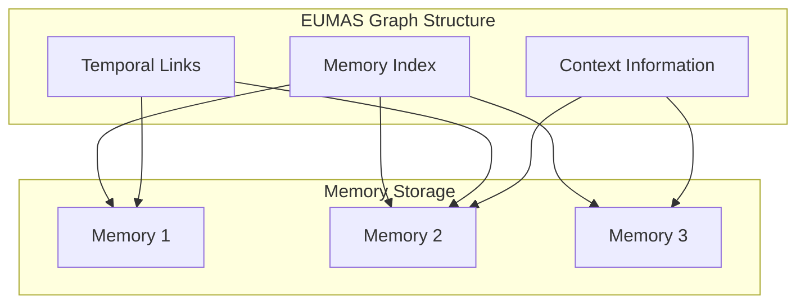
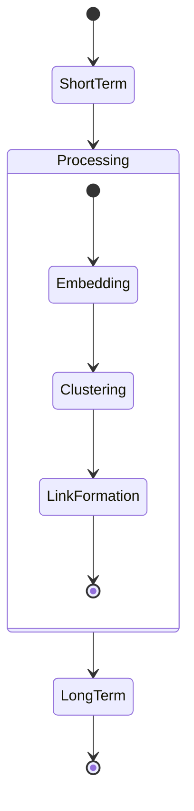

# Neuroscience Principles

## Hippocampal Indexing Theory

### Overview
The hippocampus acts as an index for memories stored throughout the cortex, similar to how EUMAS uses a graph structure to index and relate memories.



### Implementation in EUMAS
- Graph nodes represent memory indices
- Edge weights simulate synaptic strengths
- Context embeddings mirror hippocampal context cells

## Neural Pattern Completion

### Mechanism
When presented with partial information, the brain can reconstruct complete memories through pattern completion in the CA3 region of the hippocampus.

### EUMAS Implementation
```python
def pattern_completion(partial_memory: dict):
    # Generate embedding for partial memory
    partial_embedding = generate_embedding(partial_memory)
    
    # Find similar memory patterns
    similar_patterns = find_similar_memories(
        embedding=partial_embedding,
        threshold=0.7
    )
    
    # Complete the pattern using graph traversal
    completed_memory = reconstruct_memory(similar_patterns)
    return completed_memory
```

## Memory Consolidation

### Biological Process
1. Short-term memory formation in hippocampus
2. Gradual transfer to cortex during sleep/rest
3. Formation of stable long-term memories

### EUMAS Parallel


## Hebbian Learning

### Principle
"Neurons that fire together, wire together" - Donald Hebb

### Implementation
```sql
-- Strengthen connections between frequently co-activated memories
UPDATE memory_temporal_links
SET strength = strength + 
    CASE 
        WHEN frequency > threshold THEN learning_rate
        ELSE -decay_rate
    END
WHERE source_memory_id = :id1 
  AND target_memory_id = :id2;
```

## Context-Dependent Recall

### Biological Basis
- Place cells in hippocampus
- Context-dependent firing patterns
- State-dependent memory

### EUMAS Context System
```python
class ContextEngine:
    def __init__(self):
        self.current_context = {}
        self.context_history = []
    
    def update_context(self, new_context: dict):
        # Merge with existing context
        self.current_context.update(new_context)
        self.context_history.append(new_context)
    
    def get_context_weighted_memories(self):
        return find_memories_by_context(
            context=self.current_context,
            history=self.context_history
        )
```

## Memory Plasticity

### Biological Mechanism
- Long-term potentiation (LTP)
- Synaptic pruning
- Dendritic spine formation

### EUMAS Implementation
```python
def adjust_memory_strength(memory_id: str, interaction: dict):
    # Calculate plasticity factor
    plasticity = calculate_plasticity(
        frequency=interaction['frequency'],
        recency=interaction['recency'],
        importance=interaction['importance']
    )
    
    # Update memory connections
    update_memory_connections(
        memory_id=memory_id,
        plasticity_factor=plasticity
    )
```

## Research Applications

### Current Research Integration
1. **Pattern Separation and Completion**
   - Distinct memory representations
   - Partial memory reconstruction

2. **Temporal Context Model**
   - Context-based memory search
   - Temporal clustering effects

3. **Predictive Coding**
   - Error-driven learning
   - Memory prediction

### Future Directions
- Integration of attention mechanisms
- Emotional memory modulation
- Sleep-like consolidation processes
