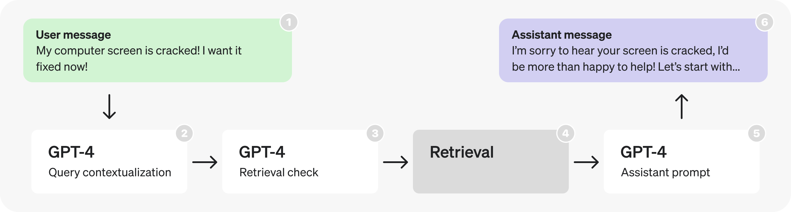
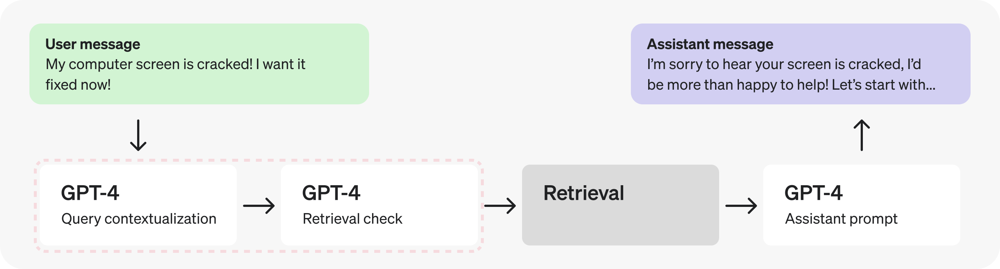
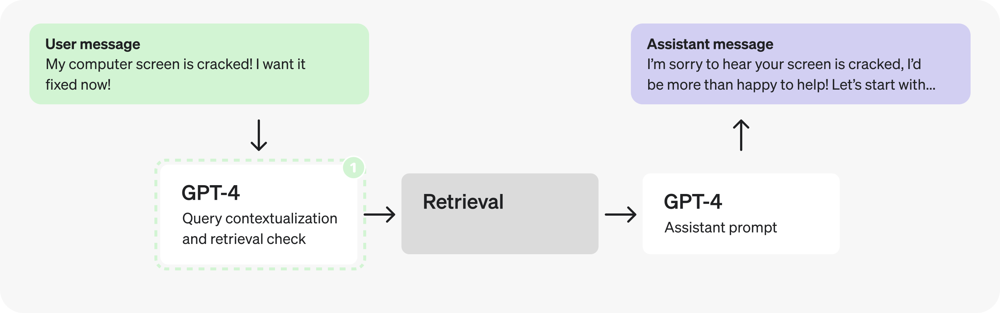
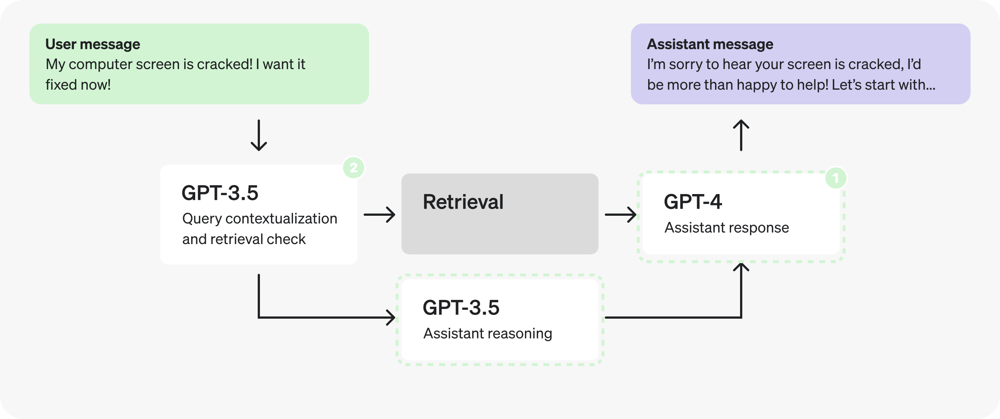
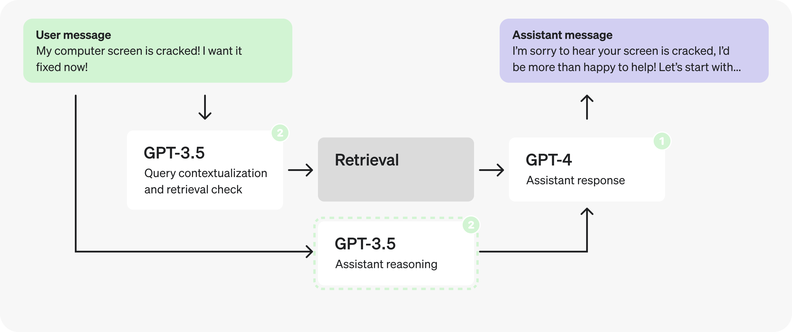
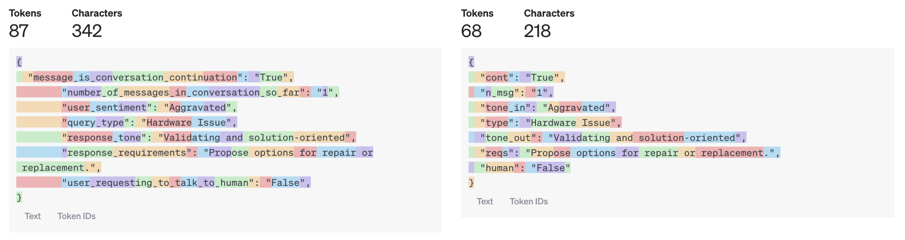
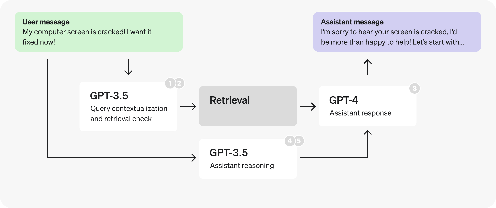

Prompt caching
Reduce latency and cost with prompt caching.
Model prompts often contain repetitive content, like system prompts and common instructions. OpenAI routes API requests to servers that recently processed the same prompt, making it cheaper and faster than processing a prompt from scratch. This can reduce latency by up to 80% and cost by 50% for long prompts. Prompt Caching works automatically on all your API requests (no code changes required) and has no additional fees associated with it.

Prompt Caching is enabled for the following models:

Model	Text Input Cost	Audio Input Cost
gpt-4o (excludes gpt-4o-2024-05-13 and chatgpt-4o-latest)	50% less	n/a
gpt-4o-mini	50% less	n/a
gpt-4o-realtime-preview	50% less	80% less
o1-preview	50% less	n/a
o1-mini	50% less	n/a
This guide describes how prompt caching works in detail, so that you can optimize your prompts for lower latency and cost.

Structuring prompts
Cache hits are only possible for exact prefix matches within a prompt. To realize caching benefits, place static content like instructions and examples at the beginning of your prompt, and put variable content, such as user-specific information, at the end. This also applies to images and tools, which must be identical between requests.

How it works
Caching is enabled automatically for prompts that are 1024 tokens or longer. When you make an API request, the following steps occur:

Cache Lookup: The system checks if the initial portion (prefix) of your prompt is stored in the cache.
Cache Hit: If a matching prefix is found, the system uses the cached result. This significantly decreases latency and reduces costs.
Cache Miss: If no matching prefix is found, the system processes your full prompt. After processing, the prefix of your prompt is cached for future requests.
Cached prefixes generally remain active for 5 to 10 minutes of inactivity. However, during off-peak periods, caches may persist for up to one hour.

Requirements
Caching is available for prompts containing 1024 tokens or more, with cache hits occurring in increments of 128 tokens. Therefore, the number of cached tokens in a request will always fall within the following sequence: 1024, 1152, 1280, 1408, and so on, depending on the prompt's length.

All requests, including those with fewer than 1024 tokens, will display a cached_tokens field of the usage.prompt_tokens_details chat completions object indicating how many of the prompt tokens were a cache hit. For requests under 1024 tokens, cached_tokens will be zero.

"usage": {
  "prompt_tokens": 2006,
  "completion_tokens": 300,
  "total_tokens": 2306,
  "prompt_tokens_details": {
    "cached_tokens": 1920
  },
  "completion_tokens_details": {
    "reasoning_tokens": 0,
    "accepted_prediction_tokens": 0,
    "rejected_prediction_tokens": 0
  }
}
What can be cached
Messages: The complete messages array, encompassing system, user, and assistant interactions.
Images: Images included in user messages, either as links or as base64-encoded data, as well as multiple images can be sent. Ensure the detail parameter is set identically, as it impacts image tokenization.
Tool use: Both the messages array and the list of available tools can be cached, contributing to the minimum 1024 token requirement.
Structured outputs: The structured output schema serves as a prefix to the system message and can be cached.
Best practices
Structure prompts with static or repeated content at the beginning and dynamic content at the end.
Monitor metrics such as cache hit rates, latency, and the percentage of tokens cached to optimize your prompt and caching strategy.
To increase cache hits, use longer prompts and make API requests during off-peak hours, as cache evictions are more frequent during peak times.
Prompts that haven't been used recently are automatically removed from the cache. To minimize evictions, maintain a consistent stream of requests with the same prompt prefix.
Frequently asked questions
How is data privacy maintained for caches?

Prompt caches are not shared between organizations. Only members of the same organization can access caches of identical prompts.

Does Prompt Caching affect output token generation or the final response of the API?

Prompt Caching does not influence the generation of output tokens or the final response provided by the API. Regardless of whether caching is used, the output generated will be identical. This is because only the prompt itself is cached, while the actual response is computed anew each time based on the cached prompt. 

Is there a way to manually clear the cache?

Manual cache clearing is not currently available. Prompts that have not been encountered recently are automatically cleared from the cache. Typical cache evictions occur after 5-10 minutes of inactivity, though sometimes lasting up to a maximum of one hour during off-peak periods.

Will I be expected to pay extra for writing to Prompt Caching?

No. Caching happens automatically, with no explicit action needed or extra cost paid to use the caching feature.

Do cached prompts contribute to TPM rate limits?

Yes, as caching does not affect rate limits.

Is discounting for Prompt Caching available on Scale Tier and the Batch API?

Discounting for Prompt Caching is not available on the Batch API but is available on Scale Tier. With Scale Tier, any tokens that are spilled over to the shared API will also be eligible for caching.

Does Prompt Caching work on Zero Data Retention requests?

Yes, Prompt Caching is compliant with existing Zero Data Retention policies.

-----

Latency optimization
Improve latency across a wide variety of LLM-related use cases.
This guide covers the core set of principles you can apply to improve latency across a wide variety of LLM-related use cases. These techniques come from working with a wide range of customers and developers on production applications, so they should apply regardless of what you're building – from a granular workflow to an end-to-end chatbot.

While there's many individual techniques, we'll be grouping them into seven principles meant to represent a high-level taxonomy of approaches for improving latency.

At the end, we'll walk through an example to see how they can be applied.

Seven principles
Process tokens faster.
Generate fewer tokens.
Use fewer input tokens.
Make fewer requests.
Parallelize.
Make your users wait less.
Don't default to an LLM.
Process tokens faster
Inference speed is probably the first thing that comes to mind when addressing latency (but as you'll see soon, it's far from the only one). This refers to the actual rate at which the LLM processes tokens, and is often measured in TPM (tokens per minute) or TPS (tokens per second).

The main factor that influences inference speed is model size – smaller models usually run faster (and cheaper), and when used correctly can even outperform larger models. To maintain high quality performance with smaller models you can explore:

using a longer, more detailed prompt,
adding (more) few-shot examples, or
fine-tuning / distillation.
You can also employ inference optimizations like our Predicted outputs feature. Predicted outputs let you significantly reduce latency of a generation when you know most of the output ahead of time, such as code editing tasks. By giving the model a prediction, the LLM can focus more on the actual changes, and less on the content that will remain the same.

Deep dive
Compute capacity & additional inference optimizations
Generate fewer tokens
Generating tokens is almost always the highest latency step when using an LLM: as a general heuristic, cutting 50% of your output tokens may cut ~50% your latency. The way you reduce your output size will depend on output type:

If you're generating natural language, simply asking the model to be more concise ("under 20 words" or "be very brief") may help. You can also use few shot examples and/or fine-tuning to teach the model shorter responses.

If you're generating structured output, try to minimize your output syntax where possible: shorten function names, omit named arguments, coalesce parameters, etc.

Finally, while not common, you can also use max_tokens or stop_tokens to end your generation early.

Always remember: an output token cut is a (milli)second earned!

Use fewer input tokens
While reducing the number of input tokens does result in lower latency, this is not usually a significant factor – cutting 50% of your prompt may only result in a 1-5% latency improvement. Unless you're working with truly massive context sizes (documents, images), you may want to spend your efforts elsewhere.

That being said, if you are working with massive contexts (or you're set on squeezing every last bit of performance and you've exhausted all other options) you can use the following techniques to reduce your input tokens:

Fine-tuning the model, to replace the need for lengthy instructions / examples.
Filtering context input, like pruning RAG results, cleaning HTML, etc.
Maximize shared prompt prefix, by putting dynamic portions (e.g. RAG results, history, etc) later in the prompt. This makes your request more KV cache-friendly (which most LLM providers use) and means fewer input tokens are processed on each request.
Check out our docs to learn more about how prompt caching works.

Make fewer requests
Each time you make a request you incur some round-trip latency – this can start to add up.

If you have sequential steps for the LLM to perform, instead of firing off one request per step consider putting them in a single prompt and getting them all in a single response. You'll avoid the additional round-trip latency, and potentially also reduce complexity of processing multiple responses.

An approach to doing this is by collecting your steps in an enumerated list in the combined prompt, and then requesting the model to return the results in named fields in a JSON. This way you can easily parse out and reference each result!

Parallelize
Parallelization can be very powerful when performing multiple steps with an LLM.

If the steps are not strictly sequential, you can split them out into parallel calls. Two shirts take just as long to dry as one.

If the steps are strictly sequential, however, you might still be able to leverage speculative execution. This is particularly effective for classification steps where one outcome is more likely than the others (e.g. moderation).

Start step 1 & step 2 simultaneously (e.g. input moderation & story generation)
Verify the result of step 1
If result was not the expected, cancel step 2 (and retry if necessary)
If your guess for step 1 is right, then you essentially got to run it with zero added latency!

Make your users wait less
There's a huge difference between waiting and watching progress happen – make sure your users experience the latter. Here are a few techniques:

Streaming: The single most effective approach, as it cuts the waiting time to a second or less. (ChatGPT would feel pretty different if you saw nothing until each response was done.)
Chunking: If your output needs further processing before being shown to the user (moderation, translation) consider processing it in chunks instead of all at once. Do this by streaming to your backend, then sending processed chunks to your frontend.
Show your steps: If you're taking multiple steps or using tools, surface this to the user. The more real progress you can show, the better.
Loading states: Spinners and progress bars go a long way.
Note that while showing your steps & having loading states have a mostly psychological effect, streaming & chunking genuinely do reduce overall latency once you consider the app + user system: the user will finish reading a response sooner.

Don't default to an LLM
LLMs are extremely powerful and versatile, and are therefore sometimes used in cases where a faster classical method would be more appropriate. Identifying such cases may allow you to cut your latency significantly. Consider the following examples:

Hard-coding: If your output is highly constrained, you may not need an LLM to generate it. Action confirmations, refusal messages, and requests for standard input are all great candidates to be hard-coded. (You can even use the age-old method of coming up with a few variations for each.)
Pre-computing: If your input is constrained (e.g. category selection) you can generate multiple responses in advance, and just make sure you never show the same one to a user twice.
Leveraging UI: Summarized metrics, reports, or search results are sometimes better conveyed with classical, bespoke UI components rather than LLM-generated text.
Traditional optimization techniques: An LLM application is still an application; binary search, caching, hash maps, and runtime complexity are all still useful in a world of LLMs.
Example
Let's now look at a sample application, identify potential latency optimizations, and propose some solutions!

We'll be analyzing the architecture and prompts of a hypothetical customer service bot inspired by real production applications. The architecture and prompts section sets the stage, and the analysis and optimizations section will walk through the latency optimization process.

You'll notice this example doesn't cover every single principle, much like real-world use cases don't require applying every technique.

Architecture and prompts
The following is the initial architecture for a hypothetical customer service bot. This is what we'll be making changes to.

At a high level, the diagram flow describes the following process:

A user sends a message as part of an ongoing conversation.
The last message is turned into a self-contained query (see examples in prompt).
We determine whether or not additional (retrieved) information is required to respond to that query.
Retrieval is performed, producing search results.
The assistant reasons about the user's query and search results, and produces a response.
The response is sent back to the user.
Below are the prompts used in each part of the diagram. While they are still only hypothetical and simplified, they are written with the same structure and wording that you would find in a production application.

Places where you see placeholders like "[user input here]" represent dynamic portions, that would be replaced by actual data at runtime.

Query contextualization prompt
Re-writes user query to be a self-contained search query.

SYSTEM
Given the previous conversation, re-write the last user query so it contains
all necessary context.

# Example
History: [{user: "What is your return policy?"},{assistant: "..."}]
User Query: "How long does it cover?"
Response: "How long does the return policy cover?"

# Conversation
[last 3 messages of conversation]

# User Query
[last user query]
USER
[JSON-formatted input conversation here]
Retrieval check prompt
Determines whether a query requires performing retrieval to respond.

SYSTEM
Given a user query, determine whether it requires doing a realtime lookup to
respond to.

# Examples
User Query: "How can I return this item after 30 days?"
Response: "true"

User Query: "Thank you!"
Response: "false"
USER
[input user query here]
Assistant prompt
Fills the fields of a JSON to reason through a pre-defined set of steps to produce a final response given a user conversation and relevant retrieved information.

SYSTEM
You are a helpful customer service bot.

Use the result JSON to reason about each user query - use the retrieved context.

# Example

User: "My computer screen is cracked! I want it fixed now!!!"

Assistant Response:
{
"message_is_conversation_continuation": "True",
"number_of_messages_in_conversation_so_far": "1",
"user_sentiment": "Aggravated",
"query_type": "Hardware Issue",
"response_tone": "Validating and solution-oriented",
"response_requirements": "Propose options for repair or replacement.",
"user_requesting_to_talk_to_human": "False",
"enough_information_in_context": "True"
"response": "..."
}
USER
# Relevant Information
` ` `
[retrieved context]
` ` `
USER
[input user query here]
Analysis and optimizations
Part 1: Looking at retrieval prompts
Looking at the architecture, the first thing that stands out is the consecutive GPT-4 calls - these hint at a potential inefficiency, and can often be replaced by a single call or parallel calls.

In this case, since the check for retrieval requires the contextualized query, let's combine them into a single prompt to make fewer requests.

Combined query contextualization and retrieval check prompt
What changed? Before, we had one prompt to re-write the query and one to determine whether this requires doing a retrieval lookup. Now, this combined prompt does both. Specifically, notice the updated instruction in the first line of the prompt, and the updated output JSON:

{
query:"[contextualized query]",
retrieval:"[true/false - whether retrieval is required]"
}
SYSTEM
Given the previous conversation, re-write the last user query so it contains
all necessary context. Then, determine whether the full request requires doing a
realtime lookup to respond to.

Respond in the following form:
{
query:"[contextualized query]",
retrieval:"[true/false - whether retrieval is required]"
}

# Examples

History: [{user: "What is your return policy?"},{assistant: "..."}]
User Query: "How long does it cover?"
Response: {query: "How long does the return policy cover?", retrieval: "true"}

History: [{user: "How can I return this item after 30 days?"},{assistant: "..."}]
User Query: "Thank you!"
Response: {query: "Thank you!", retrieval: "false"}

# Conversation
[last 3 messages of conversation]

# User Query
[last user query]
USER
[JSON-formatted input conversation here]

Actually, adding context and determining whether to retrieve are very straightforward and well defined tasks, so we can likely use a smaller, fine-tuned model instead. Switching to GPT-3.5 will let us process tokens faster.

Assistants object architecture diagram

Part 2: Analyzing the assistant prompt
Let's now direct our attention to the Assistant prompt. There seem to be many distinct steps happening as it fills the JSON fields – this could indicate an opportunity to parallelize.

Assistants object architecture diagram

However, let's pretend we have run some tests and discovered that splitting the reasoning steps in the JSON produces worse responses, so we need to explore different solutions.

Could we use a fine-tuned GPT-3.5 instead of GPT-4? Maybe – but in general, open-ended responses from assistants are best left to GPT-4 so it can better handle a greater range of cases. That being said, looking at the reasoning steps themselves, they may not all require GPT-4 level reasoning to produce. The well defined, limited scope nature makes them and good potential candidates for fine-tuning.

{
"message_is_conversation_continuation": "True", // <-
"number_of_messages_in_conversation_so_far": "1", // <-
"user_sentiment": "Aggravated", // <-
"query_type": "Hardware Issue", // <-
"response_tone": "Validating and solution-oriented", // <-
"response_requirements": "Propose options for repair or replacement.", // <-
"user_requesting_to_talk_to_human": "False", // <-
"enough_information_in_context": "True" // <-
"response": "..." // X -- benefits from GPT-4
}
This opens up the possibility of a trade-off. Do we keep this as a single request entirely generated by GPT-4, or split it into two sequential requests and use GPT-3.5 for all but the final response? We have a case of conflicting principles: the first option lets us make fewer requests, but the second may let us process tokens faster.

As with many optimization tradeoffs, the answer will depend on the details. For example:

The proportion of tokens in the response vs the other fields.
The average latency decrease from processing most fields faster.
The average latency increase from doing two requests instead of one.
The conclusion will vary by case, and the best way to make the determiation is by testing this with production examples. In this case let's pretend the tests indicated it's favorable to split the prompt in two to process tokens faster.

Assistants object architecture diagram

Note: We'll be grouping response and enough_information_in_context together in the second prompt to avoid passing the retrieved context to both new prompts.

Assistants prompt - reasoning
This prompt will be passed to GPT-3.5 and can be fine-tuned on curated examples.

What changed? The "enough_information_in_context" and "response" fields were removed, and the retrieval results are no longer loaded into this prompt.

SYSTEM
You are a helpful customer service bot.

Based on the previous conversation, respond in a JSON to determine the required
fields.

# Example

User: "My freaking computer screen is cracked!"

Assistant Response:
{
"message_is_conversation_continuation": "True",
"number_of_messages_in_conversation_so_far": "1",
"user_sentiment": "Aggravated",
"query_type": "Hardware Issue",
"response_tone": "Validating and solution-oriented",
"response_requirements": "Propose options for repair or replacement.",
"user_requesting_to_talk_to_human": "False",
}
Assistants prompt - response
This prompt will be processed by GPT-4 and will receive the reasoning steps determined in the prior prompt, as well as the results from retrieval.

What changed? All steps were removed except for "enough_information_in_context" and "response". Additionally, the JSON we were previously filling in as output will be passed in to this prompt.

SYSTEM
You are a helpful customer service bot.

Use the retrieved context, as well as these pre-classified fields, to respond to
the user's query.

# Reasoning Fields
` ` `
[reasoning json determined in previous GPT-3.5 call]
` ` `

# Example

User: "My freaking computer screen is cracked!"

Assistant Response:
{
"enough_information_in_context": "True"
"response": "..."
}
USER
# Relevant Information
` ` `
[retrieved context]
` ` `

In fact, now that the reasoning prompt does not depend on the retrieved context we can parallelize and fire it off at the same time as the retrieval prompts.

Part 3: Optimizing the structured output
Let's take another look at the reasoning prompt.

Taking a closer look at the reasoning JSON you may notice the field names themselves are quite long.

{
"message_is_conversation_continuation": "True", // <-
"number_of_messages_in_conversation_so_far": "1", // <-
"user_sentiment": "Aggravated", // <-
"query_type": "Hardware Issue", // <-
"response_tone": "Validating and solution-oriented", // <-
"response_requirements": "Propose options for repair or replacement.", // <-
"user_requesting_to_talk_to_human": "False", // <-
}
By making them shorter and moving explanations to the comments we can generate fewer tokens.

{
"cont": "True", // whether last message is a continuation
"n_msg": "1", // number of messages in the continued conversation
"tone_in": "Aggravated", // sentiment of user query
"type": "Hardware Issue", // type of the user query
"tone_out": "Validating and solution-oriented", // desired tone for response
"reqs": "Propose options for repair or replacement.", // response requirements
"human": "False", // whether user is expressing want to talk to human
}

This small change removed 19 output tokens. While with GPT-3.5 this may only result in a few millisecond improvement, with GPT-4 this could shave off up to a second.

You might imagine, however, how this can have quite a significant impact for larger model outputs.

We could go further and use single chatacters for the JSON fields, or put everything in an array, but this may start to hurt our response quality. The best way to know, once again, is through testing.

Example wrap-up
Let's review the optimizations we implemented for the customer service bot example:

Combined query contextualization and retrieval check steps to make fewer requests.
For the new prompt, switched to a smaller, fine-tuned GPT-3.5 to process tokens faster.
Split the assistant prompt in two, switching to a smaller, fine-tuned GPT-3.5 for the reasoning, again to process tokens faster.
Parallelized the retrieval checks and the reasoning steps.
Shortened reasoning field names and moved comments into the prompt, to generate fewer tokens.

----

Advanced usage
Use advanced techniques for reproducibility and parameter tuning.
OpenAI's text generation models (often called generative pre-trained transformers or large language models) have been trained to understand natural language, code, and images. The models provide text outputs in response to their inputs. The text inputs to these models are also referred to as "prompts". Designing a prompt is essentially how you “program” a large language model model, usually by providing instructions or some examples of how to successfully complete a task.

Reproducible outputs
Chat Completions are non-deterministic by default (which means model outputs may differ from request to request). That being said, we offer some control towards deterministic outputs by giving you access to the seed parameter and the system_fingerprint response field.

To receive (mostly) deterministic outputs across API calls, you can:

Set the seed parameter to any integer of your choice and use the same value across requests you'd like deterministic outputs for.
Ensure all other parameters (like prompt or temperature) are the exact same across requests.
Sometimes, determinism may be impacted due to necessary changes OpenAI makes to model configurations on our end. To help you keep track of these changes, we expose the system_fingerprint field. If this value is different, you may see different outputs due to changes we've made on our systems.

Deterministic outputs
Explore the new seed parameter in the OpenAI cookbook

Managing tokens
Language models read and write text in chunks called tokens. In English, a token can be as short as one character or as long as one word (e.g., a or apple), and in some languages tokens can be even shorter than one character or even longer than one word.

As a rough rule of thumb, 1 token is approximately 4 characters or 0.75 words for English text.

Check out our Tokenizer tool to test specific strings and see how they are translated into tokens.

For example, the string "ChatGPT is great!" is encoded into six tokens: ["Chat", "G", "PT", " is", " great", "!"].

The total number of tokens in an API call affects:

How much your API call costs, as you pay per token
How long your API call takes, as writing more tokens takes more time
Whether your API call works at all, as total tokens must be below the model's maximum limit (4097 tokens for gpt-3.5-turbo)
Both input and output tokens count toward these quantities. For example, if your API call used 10 tokens in the message input and you received 20 tokens in the message output, you would be billed for 30 tokens. Note however that for some models the price per token is different for tokens in the input vs. the output (see the pricing page for more information).

To see how many tokens are used by an API call, check the usage field in the API response (e.g., response['usage']['total_tokens']).

Chat models like gpt-3.5-turbo and gpt-4-turbo-preview use tokens in the same way as the models available in the completions API, but because of their message-based formatting, it's more difficult to count how many tokens will be used by a conversation.

Deep dive
Counting tokens for chat API calls
Below is an example function for counting tokens for messages passed to gpt-3.5-turbo-0613.

The exact way that messages are converted into tokens may change from model to model. So when future model versions are released, the answers returned by this function may be only approximate.

def num_tokens_from_messages(messages, model="gpt-3.5-turbo-0613"):
  """Returns the number of tokens used by a list of messages."""
  try:
      encoding = tiktoken.encoding_for_model(model)
  except KeyError:
      encoding = tiktoken.get_encoding("cl100k_base")
  if model == "gpt-3.5-turbo-0613":  # note: future models may deviate from this
      num_tokens = 0
      for message in messages:
          num_tokens += 4  # every message follows <im_start>{role/name}\n{content}<im_end>\n
          for key, value in message.items():
              num_tokens += len(encoding.encode(value))
              if key == "name":  # if there's a name, the role is omitted
                  num_tokens += -1  # role is always required and always 1 token
      num_tokens += 2  # every reply is primed with <im_start>assistant
      return num_tokens
  else:
      raise NotImplementedError(f"""num_tokens_from_messages() is not presently implemented for model {model}.""")
Next, create a message and pass it to the function defined above to see the token count, this should match the value returned by the API usage parameter:

messages = [
  {"role": "system", "content": "You are a helpful, pattern-following assistant that translates corporate jargon into plain English."},
  {"role": "system", "name":"example_user", "content": "New synergies will help drive top-line growth."},
  {"role": "system", "name": "example_assistant", "content": "Things working well together will increase revenue."},
  {"role": "system", "name":"example_user", "content": "Let's circle back when we have more bandwidth to touch base on opportunities for increased leverage."},
  {"role": "system", "name": "example_assistant", "content": "Let's talk later when we're less busy about how to do better."},
  {"role": "user", "content": "This late pivot means we don't have time to boil the ocean for the client deliverable."},
]

model = "gpt-3.5-turbo-0613"

print(f"{num_tokens_from_messages(messages, model)} prompt tokens counted.")
# Should show ~126 total_tokens
To confirm the number generated by our function above is the same as what the API returns, create a new Chat Completion:

# example token count from the OpenAI API
from openai import OpenAI
client = OpenAI()

response = client.chat.completions.create(
  model=model,
  messages=messages,
  temperature=0,
)

print(f'{response.usage.prompt_tokens} prompt tokens used.')
To see how many tokens are in a text string without making an API call, use OpenAI’s tiktoken Python library. Example code can be found in the OpenAI Cookbook’s guide on how to count tokens with tiktoken.

Each message passed to the API consumes the number of tokens in the content, role, and other fields, plus a few extra for behind-the-scenes formatting. This may change slightly in the future.

If a conversation has too many tokens to fit within a model’s maximum limit (e.g., more than 4097 tokens for gpt-3.5-turbo or more than 128k tokens for gpt-4o), you will have to truncate, omit, or otherwise shrink your text until it fits. Beware that if a message is removed from the messages input, the model will lose all knowledge of it.

Note that very long conversations are more likely to receive incomplete replies. For example, a gpt-3.5-turbo conversation that is 4090 tokens long will have its reply cut off after just 6 tokens.

Parameter details
Frequency and presence penalties
The frequency and presence penalties found in the Chat Completions API and Legacy Completions API can be used to reduce the likelihood of sampling repetitive sequences of tokens.

Deep dive
Penalties behind the scenes
They work by directly modifying the logits (un-normalized log-probabilities) with an additive contribution.

mu[j] -> mu[j] - c[j] * alpha_frequency - float(c[j] > 0) * alpha_presence
Where:

mu[j] is the logits of the j-th token
c[j] is how often that token was sampled prior to the current position
float(c[j] > 0) is 1 if c[j] > 0 and 0 otherwise
alpha_frequency is the frequency penalty coefficient
alpha_presence is the presence penalty coefficient
As we can see, the presence penalty is a one-off additive contribution that applies to all tokens that have been sampled at least once and the frequency penalty is a contribution that is proportional to how often a particular token has already been sampled.

Reasonable values for the penalty coefficients are around 0.1 to 1 if the aim is to just reduce repetitive samples somewhat. If the aim is to strongly suppress repetition, then one can increase the coefficients up to 2, but this can noticeably degrade the quality of samples. Negative values can be used to increase the likelihood of repetition.

Token log probabilities
The logprobs parameter found in the Chat Completions API and Legacy Completions API, when requested, provides the log probabilities of each output token, and a limited number of the most likely tokens at each token position alongside their log probabilities. This can be useful in some cases to assess the confidence of the model in its output, or to examine alternative responses the model might have given.

--

Handling errors
When the library is unable to connect to the API (for example, due to network connection problems or a timeout), a subclass of openai.APIConnectionError is raised.

When the API returns a non-success status code (that is, 4xx or 5xx response), a subclass of openai.APIStatusError is raised, containing status_code and response properties.

All errors inherit from openai.APIError.

import openai
from openai import OpenAI

client = OpenAI()

try:
    client.fine_tuning.jobs.create(
        model="gpt-4o",
        training_file="file-abc123",
    )
except openai.APIConnectionError as e:
    print("The server could not be reached")
    print(e.__cause__)  # an underlying Exception, likely raised within httpx.
except openai.RateLimitError as e:
    print("A 429 status code was received; we should back off a bit.")
except openai.APIStatusError as e:
    print("Another non-200-range status code was received")
    print(e.status_code)
    print(e.response)
Error codes are as followed:

Status Code	Error Type
400	BadRequestError
401	AuthenticationError
403	PermissionDeniedError
404	NotFoundError
422	UnprocessableEntityError
429	RateLimitError
>=500	InternalServerError
N/A	APIConnectionError